# Synapse-Rust 数据库 ER 图

## 一、文档概述

| 项目 | 值 |
|------|-----|
| 数据库类型 | PostgreSQL 16 |
| Schema 版本 | v6.0.0 |
| 表总数 | 114+ |
| 创建日期 | 2026-03-10 |

---

## 二、核心模块 ER 图

### 2.1 用户模块 (User Module)

```mermaid
erDiagram
    users ||--o{ devices : "has"
    users ||--o{ access_tokens : "has"
    users ||--o{ refresh_tokens : "has"
    users ||--o{ user_threepids : "has"
    users ||--o{ device_keys : "has"
    users ||--o{ cross_signing_keys : "has"
    users ||--o{ push_devices : "has"
    users ||--o{ push_rules : "has"
    users ||--o{ account_data : "has"
    users ||--o{ filters : "has"
    users ||--o{ openid_tokens : "has"
    users ||--o{ presence : "has"
    users ||--o{ password_history : "has"
    users ||--o{ media_quota : "has"
    users ||--o{ friends : "has"
    users ||--o{ friend_requests : "sends/receives"
    users ||--o{ blocked_users : "blocks"

    users {
        TEXT user_id PK "用户唯一标识符"
        TEXT username UK "用户名"
        TEXT password_hash "Argon2id 哈希密码"
        BOOLEAN is_admin "是否管理员"
        BOOLEAN is_guest "是否访客"
        BOOLEAN is_shadow_banned "是否影子封禁"
        BOOLEAN is_deactivated "是否停用"
        BIGINT created_ts "创建时间戳"
        BIGINT updated_at "更新时间"
        TEXT displayname "显示名称"
        TEXT avatar_url "头像 URL"
        TEXT email "邮箱"
        TEXT phone "手机"
        BIGINT generation "用户代数"
        TEXT consent_version "同意协议版本"
        TEXT appservice_id "应用服务 ID"
        TEXT user_type "用户类型"
        BIGINT password_changed_at "密码修改时间"
        BOOLEAN must_change_password "必须修改密码"
        BIGINT password_expires_at "密码过期时间"
        INTEGER failed_login_attempts "登录失败次数"
        BIGINT locked_until "锁定截止时间"
    }

    devices {
        TEXT device_id PK "设备 ID"
        TEXT user_id FK "用户 ID"
        TEXT display_name "设备名称"
        JSONB device_key "设备密钥"
        BIGINT last_seen_at "最后活跃时间"
        TEXT last_seen_ip "最后 IP"
        BIGINT created_ts "创建时间"
        BIGINT first_seen_ts "首次活跃时间"
        TEXT user_agent "用户代理"
    }

    access_tokens {
        BIGSERIAL id PK "主键"
        TEXT token UK "访问令牌"
        TEXT user_id FK "用户 ID"
        TEXT device_id "设备 ID"
        BIGINT created_ts "创建时间"
        BIGINT expires_at "过期时间"
        BIGINT last_used_at "最后使用时间"
        BOOLEAN is_revoked "是否撤销"
        BIGINT revoked_at "撤销时间"
    }

    refresh_tokens {
        BIGSERIAL id PK "主键"
        TEXT token_hash UK "令牌哈希"
        TEXT user_id FK "用户 ID"
        TEXT device_id "设备 ID"
        BIGINT created_ts "创建时间"
        BIGINT expires_at "过期时间"
        INTEGER use_count "使用次数"
        BOOLEAN is_revoked "是否撤销"
        JSONB client_info "客户端信息"
    }

    user_threepids {
        BIGSERIAL id PK "主键"
        TEXT user_id FK "用户 ID"
        TEXT medium "类型: email/msisdn"
        TEXT address "地址"
        BIGINT validated_at "验证时间"
        BIGINT added_ts "添加时间"
        BOOLEAN is_verified "是否验证"
        TEXT verification_token "验证令牌"
    }

    device_keys {
        BIGSERIAL id PK "主键"
        TEXT user_id FK "用户 ID"
        TEXT device_id "设备 ID"
        TEXT algorithm "算法"
        TEXT key_id "密钥 ID"
        TEXT public_key "公钥"
        JSONB signatures "签名"
        BIGINT added_ts "添加时间"
        BOOLEAN is_verified "是否验证"
        BOOLEAN is_blocked "是否阻止"
    }

    cross_signing_keys {
        BIGSERIAL id PK "主键"
        TEXT user_id FK "用户 ID"
        TEXT key_type "密钥类型"
        TEXT key_data "密钥数据"
        JSONB signatures "签名"
        BIGINT added_ts "添加时间"
    }

    password_history {
        BIGSERIAL id PK "主键"
        TEXT user_id FK "用户 ID"
        TEXT password_hash "密码哈希"
        BIGINT created_ts "创建时间"
    }
```

### 2.2 房间模块 (Room Module)

```mermaid
erDiagram
    rooms ||--o{ events : "contains"
    rooms ||--o{ room_memberships : "has"
    rooms ||--o{ room_aliases : "has"
    rooms ||--o{ room_directory : "listed_in"
    rooms ||--o{ room_summaries : "summarized_by"
    rooms ||--o{ thread_roots : "has"
    rooms ||--o{ thread_statistics : "has"
    rooms ||--o{ room_parents : "child_of"
    rooms ||--o{ space_children : "parent_of"
    rooms ||--o{ room_state_events : "has"
    rooms ||--o{ read_markers : "has"
    rooms ||--o{ event_receipts : "has"

    rooms {
        TEXT room_id PK "房间 ID"
        TEXT creator "创建者"
        BOOLEAN is_public "是否公开"
        TEXT room_version "房间版本"
        BIGINT created_ts "创建时间"
        BIGINT last_activity_at "最后活动时间"
        BOOLEAN is_federated "是否联邦"
        BOOLEAN has_guest_access "访客访问"
        TEXT join_rules "加入规则"
        TEXT history_visibility "历史可见性"
        TEXT name "房间名称"
        TEXT topic "主题"
        TEXT avatar_url "头像 URL"
        TEXT canonical_alias "规范别名"
        INTEGER member_count "成员数量"
        TEXT visibility "可见性"
    }

    events {
        TEXT event_id PK "事件 ID"
        TEXT room_id FK "房间 ID"
        TEXT sender "发送者"
        TEXT event_type "事件类型"
        JSONB content "内容"
        BIGINT origin_server_ts "服务器时间戳"
        TEXT state_key "状态键"
        BOOLEAN is_redacted "是否删除"
        BIGINT redacted_at "删除时间"
        BIGINT depth "深度"
        JSONB prev_events "前置事件"
        JSONB auth_events "授权事件"
        JSONB signatures "签名"
        JSONB hashes "哈希"
    }

    room_memberships {
        BIGSERIAL id PK "主键"
        TEXT room_id FK "房间 ID"
        TEXT user_id FK "用户 ID"
        TEXT membership "成员状态"
        BIGINT joined_at "加入时间"
        BIGINT invited_at "邀请时间"
        BIGINT left_at "离开时间"
        BIGINT banned_at "封禁时间"
        TEXT sender "邀请者"
        TEXT reason "原因"
        TEXT event_id "事件 ID"
        BOOLEAN is_banned "是否封禁"
    }

    room_aliases {
        TEXT room_alias PK "房间别名"
        TEXT room_id FK "房间 ID"
        TEXT server_name "服务器名"
        BIGINT created_ts "创建时间"
    }

    room_summaries {
        TEXT room_id PK "房间 ID"
        TEXT name "名称"
        TEXT topic "主题"
        BIGINT joined_members "已加入成员数"
        BIGINT invited_members "被邀请成员数"
        JSONB hero_users "英雄用户"
        BOOLEAN is_world_readable "世界可读"
        BOOLEAN can_guest_join "访客可加入"
        TEXT encryption_state "加密状态"
    }

    thread_roots {
        BIGSERIAL id PK "主键"
        TEXT room_id FK "房间 ID"
        TEXT event_id "事件 ID"
        TEXT sender "发送者"
        TEXT thread_id "线程 ID"
        BIGINT reply_count "回复数"
        TEXT last_reply_event_id "最后回复 ID"
        BIGINT last_reply_ts "最后回复时间"
        BOOLEAN is_fetched "是否获取"
        BIGINT created_ts "创建时间"
    }

    room_parents {
        BIGSERIAL id PK "主键"
        TEXT room_id FK "房间 ID"
        TEXT parent_room_id FK "父房间 ID"
        TEXT sender "发送者"
        BOOLEAN is_suggested "是否建议"
        JSONB via_servers "服务器列表"
        BIGINT added_ts "添加时间"
    }

    space_children {
        BIGSERIAL id PK "主键"
        TEXT space_id "Space ID"
        TEXT room_id FK "房间 ID"
        TEXT sender "发送者"
        BOOLEAN is_suggested "是否建议"
        JSONB via_servers "服务器列表"
        BIGINT added_ts "添加时间"
    }
```

### 2.3 E2EE 加密模块 (E2EE Module)

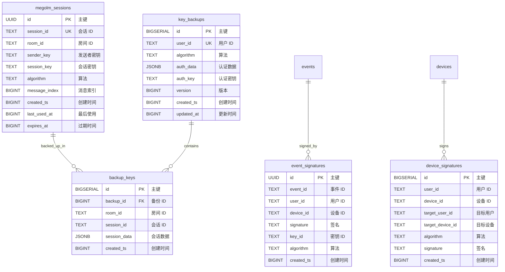

### 2.4 推送通知模块 (Push Module)

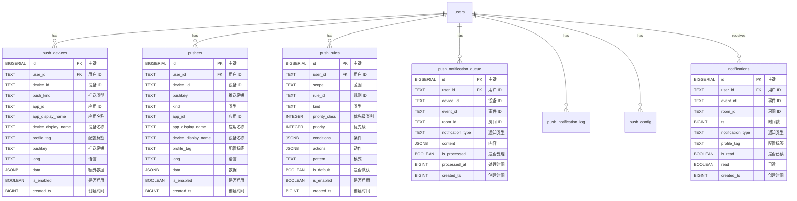

### 2.5 媒体存储模块 (Media Module)

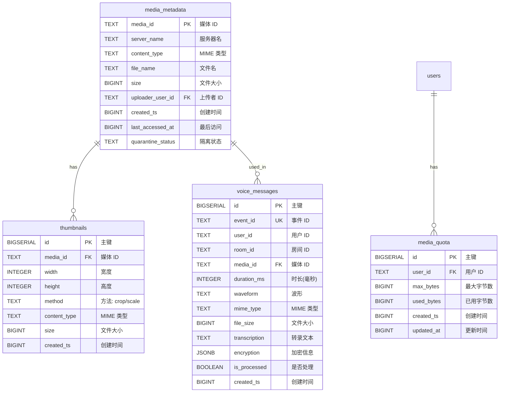

### 2.6 联邦模块 (Federation Module)

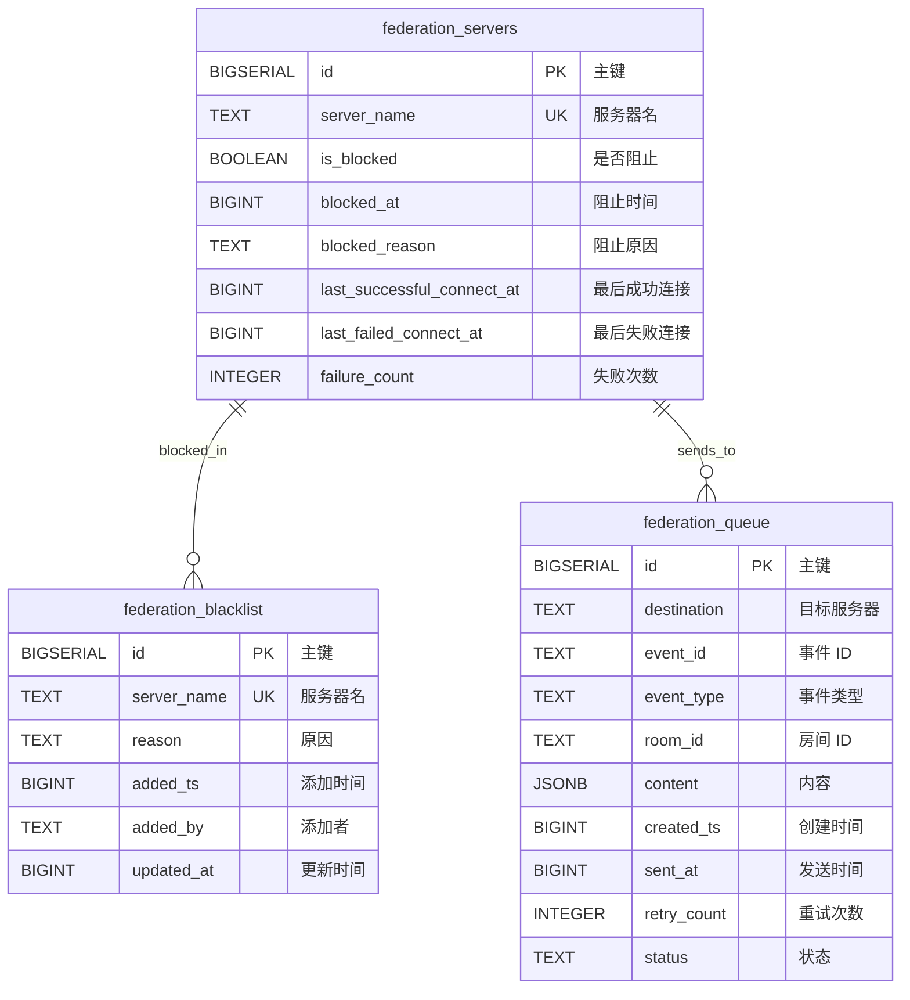

### 2.7 好友系统模块 (Friend Module)

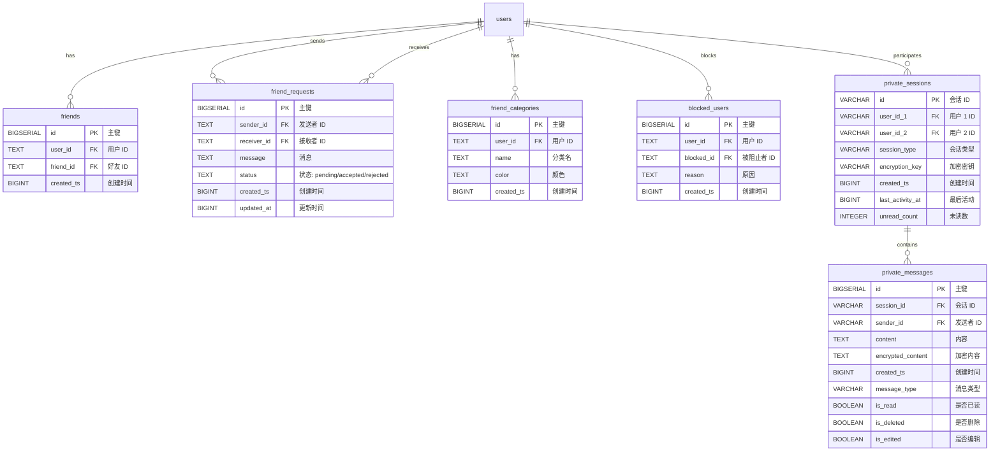

### 2.8 认证模块 (Auth Module)

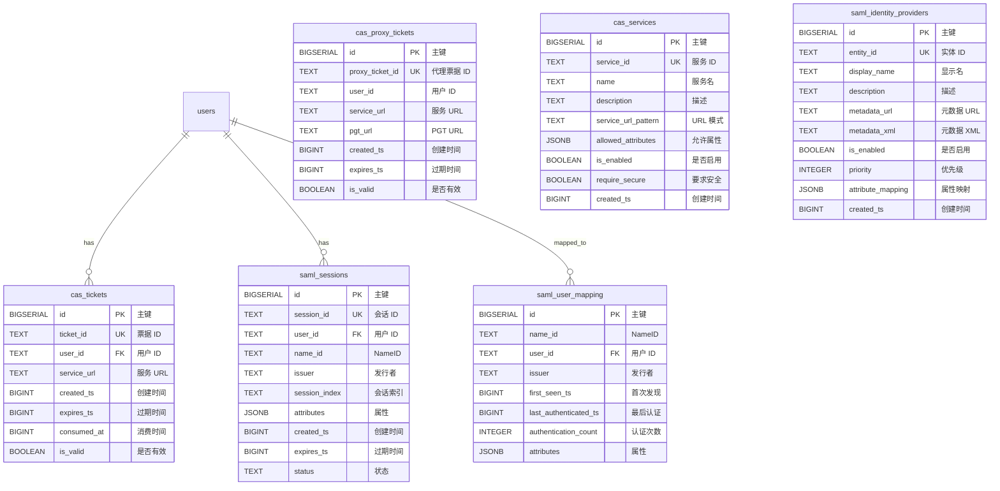

### 2.9 安全与审计模块 (Security Module)

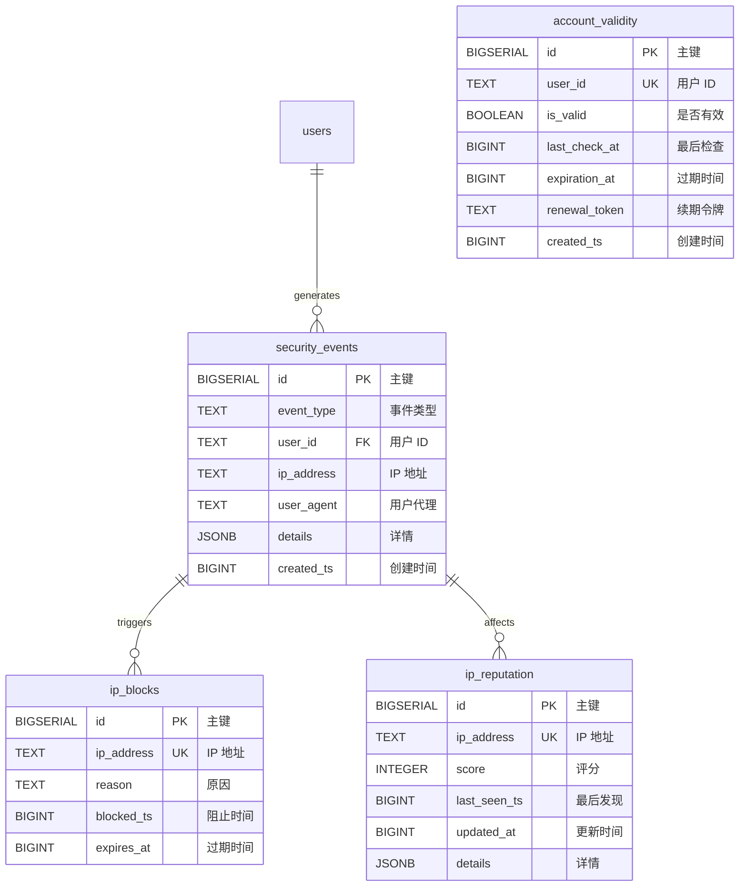

### 2.10 事件举报模块 (Report Module)

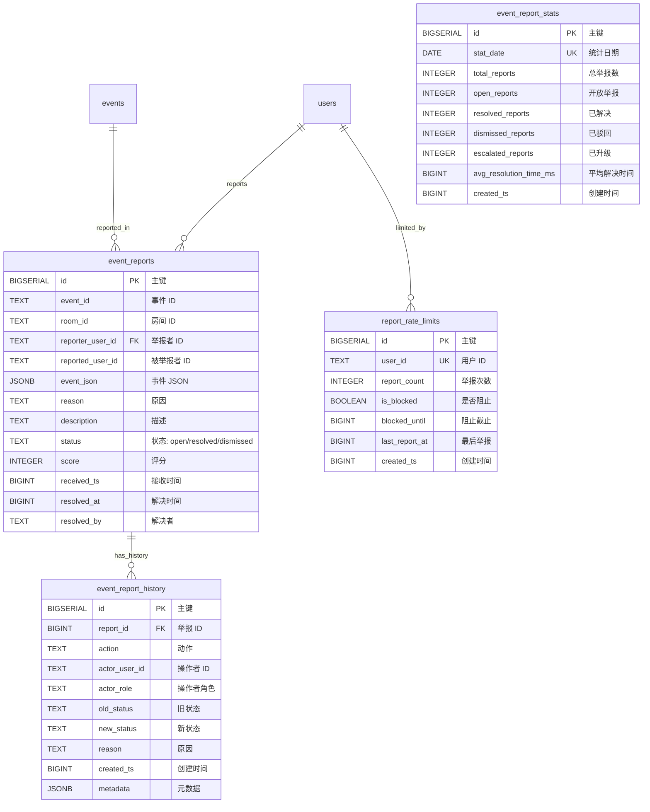

---

## 三、完整关系图

### 3.1 核心实体关系概览

```mermaid
erDiagram
    users ||--o{ devices : "has"
    users ||--o{ access_tokens : "has"
    users ||--o{ refresh_tokens : "has"
    users ||--o{ room_memberships : "joins"
    users ||--o{ events : "sends"
    users ||--o{ friends : "has"
    users ||--o{ push_devices : "has"
    users ||--o{ device_keys : "has"
    users ||--o{ account_data : "has"
    users ||--o{ presence : "has"

    rooms ||--o{ events : "contains"
    rooms ||--o{ room_memberships : "has"
    rooms ||--o{ room_aliases : "has"
    rooms ||--o{ room_summaries : "summarized_by"
    rooms ||--o{ thread_roots : "has"
    rooms ||--o{ space_children : "parent_of"

    events ||--o{ event_signatures : "signed_by"
    events ||--o{ event_reports : "reported_in"
    events ||--o{ read_markers : "marked_by"
    events ||--o{ event_receipts : "received_by"

    megolm_sessions ||--o{ backup_keys : "backed_up"
    key_backups ||--o{ backup_keys : "contains"

    federation_servers ||--o{ federation_queue : "receives"

    media_metadata ||--o{ thumbnails : "has"
    media_metadata ||--o{ voice_messages : "used_in"

    private_sessions ||--o{ private_messages : "contains"
```

### 3.2 表分类统计

| 模块 | 表数量 | 主要表 |
|------|--------|--------|
| 用户模块 | 12 | users, devices, access_tokens, refresh_tokens, user_threepids, device_keys, cross_signing_keys, password_history, token_blacklist, openid_tokens, presence, account_validity |
| 房间模块 | 14 | rooms, events, room_memberships, room_aliases, room_summaries, room_directory, room_parents, room_state_events, thread_roots, thread_statistics, space_children, space_hierarchy, read_markers, event_receipts |
| E2EE 模块 | 8 | device_keys, cross_signing_keys, megolm_sessions, key_backups, backup_keys, event_signatures, device_signatures, to_device_messages |
| 推送模块 | 8 | push_devices, pushers, push_rules, push_notification_queue, push_notification_log, push_config, notifications, room_invites |
| 媒体模块 | 4 | media_metadata, thumbnails, media_quota, voice_messages |
| 联邦模块 | 3 | federation_servers, federation_blacklist, federation_queue |
| 好友模块 | 6 | friends, friend_requests, friend_categories, blocked_users, private_sessions, private_messages |
| 认证模块 | 12 | cas_tickets, cas_proxy_tickets, cas_proxy_granting_tickets, cas_services, cas_user_attributes, cas_slo_sessions, saml_sessions, saml_user_mapping, saml_identity_providers, saml_auth_events, saml_logout_requests, registration_tokens |
| 安全模块 | 4 | security_events, ip_blocks, ip_reputation, account_validity |
| 举报模块 | 4 | event_reports, event_report_history, report_rate_limits, event_report_stats |
| 账户数据 | 5 | account_data, room_account_data, user_account_data, filters, user_filters |
| 后台任务 | 4 | background_updates, workers, sync_stream_id, schema_migrations |
| 验证码 | 4 | registration_captcha, captcha_send_log, captcha_template, captcha_config |
| 其他 | 20+ | modules, spam_check_results, third_party_rule_results, sliding_sync_rooms, thread_subscriptions 等 |

---

## 四、外键约束汇总

### 4.1 级联删除关系

| 从表 | 外键字段 | 引用表 | 删除行为 |
|------|----------|--------|----------|
| devices | user_id | users | CASCADE |
| access_tokens | user_id | users | CASCADE |
| refresh_tokens | user_id | users | CASCADE |
| user_threepids | user_id | users | CASCADE |
| device_keys | user_id | users | CASCADE |
| cross_signing_keys | user_id | users | CASCADE |
| push_notification_queue | user_id | users | CASCADE |
| password_history | user_id | users | CASCADE |
| openid_tokens | user_id | users | CASCADE |
| presence | user_id | users | CASCADE |
| media_quota | user_id | users | CASCADE |
| friends | user_id | users | CASCADE |
| friends | friend_id | users | CASCADE |
| friend_requests | sender_id | users | CASCADE |
| friend_requests | receiver_id | users | CASCADE |
| friend_categories | user_id | users | CASCADE |
| blocked_users | user_id | users | CASCADE |
| blocked_users | blocked_id | users | CASCADE |
| private_sessions | user_id_1 | users | CASCADE |
| private_sessions | user_id_2 | users | CASCADE |
| private_messages | sender_id | users | CASCADE |
| events | room_id | rooms | CASCADE |
| room_memberships | room_id | rooms | CASCADE |
| room_memberships | user_id | users | CASCADE |
| room_aliases | room_id | rooms | CASCADE |
| room_directory | room_id | rooms | CASCADE |
| room_summaries | room_id | rooms | CASCADE |
| thread_roots | room_id | rooms | CASCADE |
| thread_statistics | room_id | rooms | CASCADE |
| room_parents | room_id | rooms | CASCADE |
| room_parents | parent_room_id | rooms | CASCADE |
| room_state_events | room_id | rooms | CASCADE |
| read_markers | room_id | rooms | CASCADE |
| event_receipts | room_id | rooms | CASCADE |
| backup_keys | backup_id | key_backups | CASCADE |
| thumbnails | media_id | media_metadata | CASCADE |
| module_execution_logs | module_id | modules | CASCADE |
| event_report_history | report_id | event_reports | CASCADE |
| registration_token_usage | token_id | registration_tokens | CASCADE |
| private_messages | session_id | private_sessions | CASCADE |

---

## 五、索引设计原则

### 5.1 复合索引

| 索引名 | 表 | 字段 | 用途 |
|--------|-----|------|------|
| idx_room_memberships_user_membership | room_memberships | (user_id, membership) | 用户房间列表查询 |
| idx_events_room_time | events | (room_id, origin_server_ts DESC) | 房间消息历史查询 |
| idx_device_keys_user_device | device_keys | (user_id, device_id) | 用户设备列表查询 |
| idx_push_rules_user_priority | push_rules | (user_id, priority) | 推送规则匹配 |
| idx_events_sender_type | events | (sender, event_type) | 用户事件查询 |
| idx_room_memberships_room_membership | room_memberships | (room_id, membership) | 房间成员查询 |

### 5.2 JSONB GIN 索引

| 索引名 | 表 | 字段 | 用途 |
|--------|-----|------|------|
| idx_events_content_gin | events | content | 消息内容搜索 |
| idx_account_data_content_gin | account_data | content | 账户数据查询 |
| idx_user_account_data_content_gin | user_account_data | content | 用户账户数据查询 |

### 5.3 条件索引

| 索引名 | 表 | 条件 | 用途 |
|--------|-----|------|------|
| idx_users_must_change_password | users | must_change_password = TRUE | 密码修改提醒 |
| idx_users_password_expires | users | password_expires_at IS NOT NULL | 密码过期检查 |
| idx_users_locked | users | locked_until IS NOT NULL | 账户锁定检查 |
| idx_rooms_is_public | rooms | is_public = TRUE | 公开房间列表 |
| idx_access_tokens_valid | access_tokens | is_revoked = FALSE | 有效令牌查询 |
| idx_pushers_enabled | pushers | is_enabled = TRUE | 启用的推送器 |

---

## 六、使用说明

### 6.1 在 Markdown 中渲染

本 ER 图使用 Mermaid 语法编写，可在以下环境中渲染：

1. **GitHub/GitLab**: 直接支持 Mermaid 渲染
2. **VS Code**: 安装 "Markdown Preview Mermaid Support" 插件
3. **Typora**: 原生支持 Mermaid
4. **在线工具**: [Mermaid Live Editor](https://mermaid.live/)

### 6.2 导出为图片

```bash
# 使用 mermaid-cli 导出
npx @mermaid-js/mermaid-cli -i ER_DIAGRAM.md -o er-diagram.png

# 或使用在线工具导出
# https://mermaid.live/
```

### 6.3 生成数据库文档

```bash
# 使用 schemaspy 生成 HTML 文档
java -jar schemaspy.jar -t pgsql -db synapse -host localhost -port 5432 -u synapse -p synapse -o docs/schema
```

---

*文档生成时间：2026-03-10*
*数据库版本：PostgreSQL 16*
*Schema 版本：v6.0.0*
