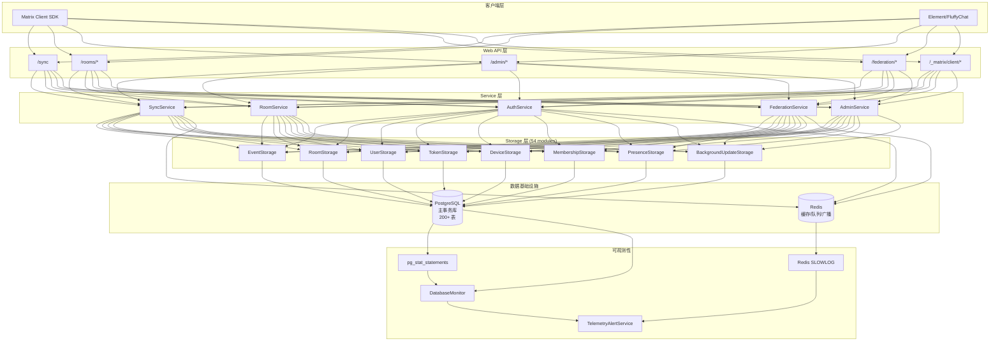
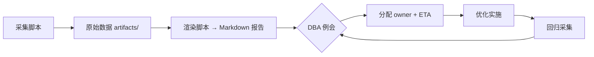
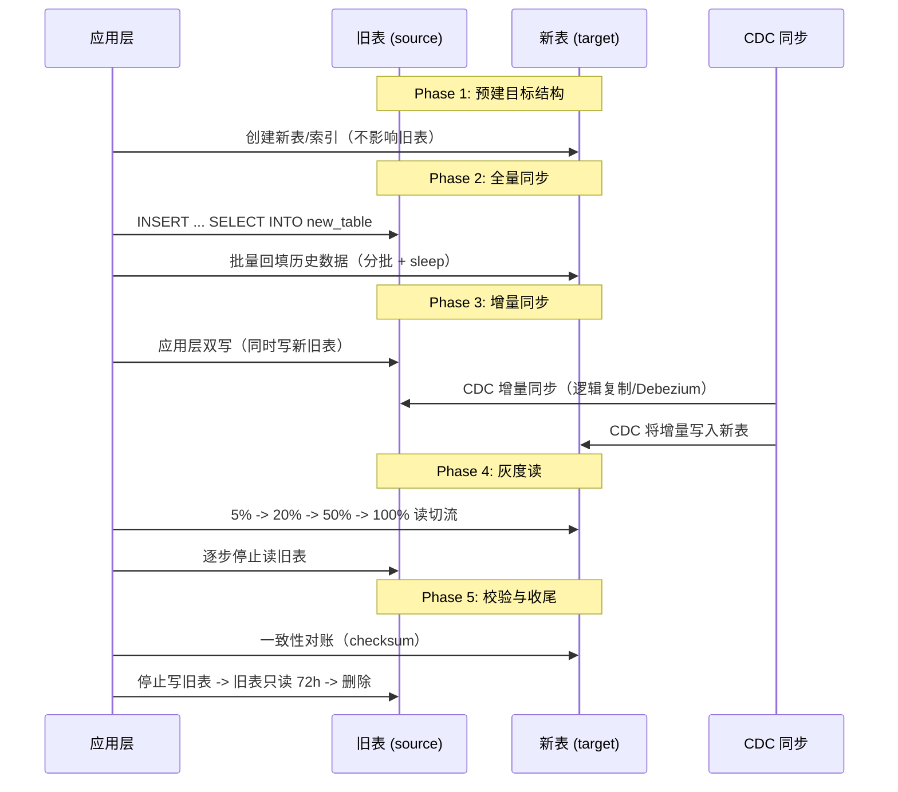

# 数据库依赖全景扫描与数据库重构优化方案

> 日期: 2026-05-09
> 版本: v2.1.0（第三轮整合版）
> 项目: `synapse-rust`
> 范围: `src/`、`migrations/`、`docker/`、`docs/db/`、运行配置与部署脚本
> 目标: 建立端到端数据库依赖基线，形成可执行的数据库重构、迁移、回滚与验证方案

---

## 目录

1. [执行摘要](#1-执行摘要)
2. [备份凭证与资产保护](#2-备份凭证与资产保护)
3. [扫描方法与数据采集体系](#3-扫描方法与数据采集体系)
4. [数据库依赖全景基线](#4-数据库依赖全景基线)
5. [多维归类分析](#5-多维归类分析)
6. [交互式依赖图谱](#6-交互式依赖图谱)
7. [风险评估与热力图](#7-风险评估与热力图)
8. [CMMI 五级成熟度评估](#8-cmmi-五级成熟度评估)
9. [重点瓶颈与候选 TOP 20 慢查询类](#9-重点瓶颈与候选-top-20-慢查询类)
10. [动态追踪与可观测性实施方案](#10-动态追踪与可观测性实施方案)
11. [数据库结构设计优化](#11-数据库结构设计优化)
12. [索引策略全面改进](#12-索引策略全面改进)
13. [查询性能优化方案](#13-查询性能优化方案)
14. [事务处理机制增强](#14-事务处理机制增强)
15. [数据迁移流程设计](#15-数据迁移流程设计)
16. [回滚机制与灾备设计](#16-回滚机制与灾备设计)
17. [性能基准测试方案](#17-性能基准测试方案)
18. [应用系统兼容性验证](#18-应用系统兼容性验证)
19. [实施路线图与时间表](#19-实施路线图与时间表)
20. [资源需求与预算](#20-资源需求与预算)
21. [预期性能提升指标](#21-预期性能提升指标)
22. [验收标准与 Gate Review](#22-验收标准与-gate-review)
23. [治理长效机制](#23-治理长效机制)
24. [最终结论](#24-最终结论)

---

## 1. 执行摘要

本次对 `synapse-rust` 的数据库依赖做了"静态代码分析 + 动态追踪方案设计"的双轨扫描，并结合项目实际业务逻辑、数据模型和现有架构进行了深度分析。

### 1.1 核心发现

1. **已确认的数据库/数据基础设施类型**
   - 主事务数据库: `PostgreSQL`（sqlx + 手写 SQL）
   - 辅助缓存/任务队列/失效广播: `Redis`（deadpool-redis）
   - 配置层存在搜索提供者抽象: `postgres | elasticsearch`，但未发现 ES 客户端落地
   - 未发现实际驱动依赖: `MySQL`、`SQLite`、`ClickHouse`

2. **访问技术栈特征**
   - ORM: `sqlx + FromRow + QueryBuilder + 手写 SQL`，非传统重型 ORM
   - SQL 质量、索引设计、约束闭环和运行时观测直接影响系统性能

3. **静态扫描量化结果**
   - **54** 个 storage 文件直接承载数据库访问
   - **146** 个 service/storage 文件与数据面强相关
   - 代码层检出 **169** 处 `SELECT`、**57** 处 `INSERT`、**69** 处 `UPDATE`、**59** 处 `DELETE`
   - 检出 **123** 处事务/锁/幂等写/并发控制关键语句
   - `00000000_unified_schema_v7.sql` 中检出 **866** 条 DDL 级定义/变更语句
   - 迁移目录共有 **36+** 个迁移文件，历史归档另外包含 **40+** 个

4. **读写比例特征**
   - `Read`: 47.7% | `Insert`: 16.1% | `Update`: 19.5% | `Delete`: 16.7%
   - 属于典型的"读多写多、写路径复杂、幂等覆盖写明显"的协作型事务系统

5. **总体判断**
   - 当前架构可以继续演进，但已不适合依赖"碎片化补丁迁移 + 人工经验式性能优化"
   - 下一阶段应进入"架构治理化"模式: 基线统一、观测闭环、约束覆盖率治理、索引回收、零停机双写迁移、演练式回滚、Gate Review 准入

### 1.2 优化范围总览

| 优化方向 | 当前状态 | 目标状态 | 优先级 |
|----------|----------|----------|--------|
| 数据库结构设计 | 200+ 表，存在 schema drift | 统一基线，约束覆盖率 >= 98% | P0 |
| 索引策略 | 大量索引但存在冗余和缺失 | 回收冗余 + 覆盖索引 + 部分索引 | P0 |
| 查询性能 | 深分页、ILIKE、全表扫描 | Keyset 分页、FTS、覆盖索引 | P0 |
| 事务处理 | 分散事务，缺少标准化 | 统一事务模板、死锁防护、超时管控 | P1 |
| 数据迁移 | 碎片化迁移文件 | 零停机双写 + CDC + 灰度切换 | P1 |
| 回滚机制 | 部分 .undo.sql，缺少演练 | 5 分钟 RTO，全量回滚演练 | P1 |
| 性能基准 | 无标准化基准测试 | TPC-C + sysbench + 自定义负载 | P1 |
| 兼容性验证 | 人工验证 | 自动化回归 + 1:1 镜像环境 | P2 |

### 1.3 当前执行进展（2026-05-09 增补）

| 项目 | 状态 | 本轮落地内容 |
|------|------|--------------|
| `v7` 收敛批次 | 已落地 | 补齐 `Batch-02`：`20260515000002_consolidated_stream_ordering_online_fix_v7.sql (+undo)` |
| Rust 代码适配 | 部分完成 | `event_report` 查询链路改为 Keyset 游标参数：`since_score/since_ts/since_id` |
| 管理端 API 文档 | 已更新 | `docs/sdk/admin.md` 新增举报分页游标说明 |
| CI 迁移治理 | 已落地 | 新增 `scripts/check_migration_consistency.py` 与 `scripts/build_sqlx_migration_source.py`，接入 `ci.yml` / `drift-detection.yml` / `benchmark.yml` |
| 性能门槛 | 已验证 | `pagination_offset_deep_page` vs `pagination_keyset_deep_page` 基准结果显示提升 `99.93%`，满足 `>= 30%` 目标 |
| 测试兜底 | 已补充 | 新增迁移镜像/回滚链路单测，补充 `event_report` Keyset 游标测试 |
| **第三轮整合** (2026-05-09) | **已落地** | **14 个增量迁移合并为 3 个批次（Batch-04/05/06），删除 23 个冗余文件，同步 docker/deploy/migrations** |

### 1.4 第三轮整合执行记录（2026-05-09）

**整合前**：migrations/ 目录共 31 个文件
**整合后**：migrations/ 目录共 17 个文件（缩减 54.8%）

| 批次 | 新文件名 | 合并源 | 源文件数 |
|------|----------|--------|----------|
| Batch-04 | `20260515000004_consolidated_schema_fixes_v7.sql` | room_ephemeral unique 约束 + backup_keys 字段 + expires_at 列修复 | 3 |
| Batch-05 | `20260515000005_consolidated_table_indexes_v7.sql` | events/users/room_memberships/access_tokens/federation_queue/background_updates 索引 + trigram + spaces + threads 搜索索引 | 9 |
| Batch-06 | `20260515000006_consolidated_constraint_governance_v7.sql` | 约束治理文件重命名（添加复合主键 + 外键补齐） | 1 |

**备份归档**：`migrations/archive/full-backup-20260509-064803/`（23 个原始文件）

**最终活跃链路**：`v7 baseline + 1 extension + 6 v7 batch` = **8 对 SQL + 1 基线 = 17 文件**

---

## 2. 备份凭证与资产保护

### 2.1 备份位置

- 备份目录: `migrations/archive/full-backup-20260507-223006/`
- 哈希清单: `migrations/archive/full-backup-20260507-223006/MANIFEST.sha256`
- 历史归档目录: `migrations/archive/pre-consolidation-2026-04-22/`

### 2.2 备份规则

- 备份对象: `migrations/` 下除 `archive/` 以外的全部现行脚本（39 个文件已备份）
- 校验方式: `SHA-256`，每个文件独立哈希 + 整体清单
- 备份验证命令:
  ```bash
  cd migrations/archive/full-backup-20260507-223006
  sha256sum -c MANIFEST.sha256
  ```

### 2.3 删除条件（四项全满足方可删除）

1. 重构完成且全部迁移合并到新基线
2. 验收测试通过（单元/集成/性能/回滚全部通过）
3. DBA 与架构师双人复核签字
4. 发布后稳定运行至少 **2 个完整业务周期**（建议 >= 30 天）

### 2.4 备份管理要求

- 任意重构阶段不得覆盖或删除该备份
- 后续每轮迁移改造均生成新的时间戳目录: `migrations/archive/full-backup-YYYYMMDD-HHMMSS/`
- 发布前后均以 `MANIFEST.sha256` 做一致性校验
- 备份保留策略: 保留最近 **3** 个版本的完整备份，更早版本可压缩归档至冷存储
- 异地备份: 备份文件同步至独立于生产环境的异地存储（S3/OSS/NAS）

### 2.5 数据级备份

除代码级备份外，生产数据库本身必须具备:

| 备份类型 | 频率 | 保留期 | 验证频率 |
|----------|------|--------|----------|
| 全量备份 (pg_dump) | 每日 | 30 天 | 每周恢复演练 |
| WAL 归档 | 持续 | 7 天 | 每日校验 |
| PITR 基线 | 每周 | 90 天 | 每月恢复演练 |
| 逻辑导出 (关键表) | 每日 | 30 天 | 每日行数对账 |

---

## 3. 扫描方法与数据采集体系

### 3.1 静态扫描

本次静态扫描采用三种手段并行：

1. **AST/类型映射提取**
   - 识别 `sqlx::FromRow`、`Pool<Postgres>`、`PgPoolOptions`
   - 识别 `deadpool_redis::Config`
   - 提取配置模型中的数据库 URL、连接池参数与功能开关

2. **正则/SQL 模式扫描**
   - 扫描 `sqlx::query*`、`QueryBuilder`
   - 提取 `SELECT / INSERT / UPDATE / DELETE / ON CONFLICT / RETURNING`
   - 提取 `BEGIN / COMMIT / advisory lock / FOR UPDATE / LIMIT OFFSET / ILIKE / LIKE / JSONB`

3. **迁移/DDL 映射提取**
   - 扫描 `CREATE TABLE / ALTER TABLE / CREATE INDEX / VIEW / TRIGGER / FUNCTION / SEQUENCE / REFERENCES`
   - 对齐 `migrations/` 与 `docker/deploy/migrations/`
   - 结合历史审计文档建立版本演进时间线

### 3.2 动态追踪

当前会话未直接对生产或长稳测试环境做 7x24 小时真实负载采集，因此动态部分采用"**现有可用观测能力核验 + 可直接执行的采集方案设计**"方式落地。

已确认项目已经具备以下动态观测入口：

- PostgreSQL `shared_preload_libraries = 'pg_stat_statements'`
- `log_min_duration_statement = 1000`（建议调整为 200ms 以获得更完整画像）
- `log_lock_waits = on`
- `deadlock_timeout = 1s`
- `track_io_timing = on`
- 连接池自监控 `DatabaseMonitor`
- 连接池告警 `TelemetryAlertService`

**已知观测缺口：**

| 缺口 | 影响 | 整改方向 |
|------|------|----------|
| `DatabaseMonitor.average_query_time_ms = 0`（硬编码） | 无法感知真实查询延迟 | 接入 `pg_stat_statements` 实时查询 |
| `DatabaseMonitor.slow_queries_count = 0`（硬编码） | 无法感知慢查询趋势 | 接入慢日志解析或 `pg_stat_statements` |
| `DatabaseMonitor.deadlock_count = 0`（硬编码） | 无法感知锁冲突趋势 | 接入 `pg_stat_database.deadlocks` |
| Redis 无 `latency-monitor` | 无法感知 Redis 延迟抖动 | 启用 `latency-monitor-threshold 100` |
| Redis 无命令级慢日志采样 | 无法定位 Redis 热点命令 | 启用 `SLOWLOG` 并定期采样 |

---

## 4. 数据库依赖全景基线

### 4.1 数据库类型识别结果

| 类型 | 识别结果 | 证据来源 | 结论 |
|------|----------|----------|------|
| PostgreSQL | 已确认 | `sqlx` postgres feature、`PgPoolOptions`、`DATABASE_URL=postgres://...`、迁移脚本 | 主事务数据库 |
| Redis | 已确认 | `redis` crate、`deadpool-redis`、`REDIS_URL=redis://...` | 缓存、任务队列、失效广播 |
| MySQL | 未发现 | 无 crate、无连接串、无迁移脚本 | 当前未使用 |
| SQLite | 未发现 | 无 crate、无文件库路径、无迁移脚本 | 当前未使用 |
| ClickHouse | 未发现 | 无 crate、无驱动配置 | 当前未使用 |
| Elasticsearch | 配置抽象存在 | `search.provider = postgres \| elasticsearch` | 非主数据库，且未见驱动落地 |

### 4.2 连接与连接池配置

#### PostgreSQL

- 连接池实现: `sqlx::postgres::PgPoolOptions`
- 关键参数:
  - `max_connections`: `config.database.max_size`（建议不超过 `PG max_connections * 0.8`）
  - `min_connections`: `config.database.min_idle.unwrap_or(5)`
  - `acquire_timeout`: `connection_timeout`（建议 5-10 秒）
  - `max_lifetime`: `DEFAULT_MAX_LIFETIME`（建议 30 分钟）
  - `idle_timeout`: `DEFAULT_IDLE_TIMEOUT`（建议 10 分钟）
  - `test_before_acquire = true`（生产环境必须启用）

#### Redis

- 连接池实现: `deadpool_redis::Config::create_pool`
- 用途: 缓存、任务队列、失效广播订阅
- 建议配置:
  - `max_size`: 50-100
  - `timeout`: 3-5 秒
  - 启用 `test_on_check_out: true`

### 4.3 DDL 对象完整盘点

| 对象类型 | 现状 | 数量（估） | 优化建议 |
|----------|------|------------|----------|
| 表 | 大规模存在 | 200+ | 清理弃用表，合并冗余表 |
| 主键/唯一键 | 广泛使用 | 200+ | 覆盖率审计，补齐缺失 PK/UK |
| 外键 | 已大量存在 | 100+ | 覆盖率与冗余性复核 |
| 普通索引 | 大量存在 | 300+ | 低命中率索引回收 |
| 复合索引 | 大量存在 | 100+ | 字段顺序优化 |
| 部分索引 | 已存在 | 10+ | 扩展应用到更多场景 |
| 函数/表达式索引 | 已存在 | 5+ | 搜索场景扩展 |
| GIN/JSONB 索引 | 已存在 | 5+ | 文本检索场景扩展 |
| 视图 | 已确认 | 2+ | `active_workers`、`worker_type_statistics` |
| 触发器 | 已确认 | 3+ | `update_updated_ts_column()` |
| 函数 | 已确认 | 1+ | `update_updated_ts` 函数 |
| 序列 | 已确认 | 5+ | `sliding_sync_pos_seq`、`to_device_stream_id_seq`、`events_stream_ordering_seq` 等 |
| 物化视图 | 已检出 | 2 | `rooms_summaries`、`public_room_directory`（2026-05-09 新增） |
| 分区表 | 未检出 | 0 | `events` 大表建议评估分区 |

### 4.4 数据访问模式分析

#### 代码级访问特征

| 模式 | 量化结果 | 说明 |
|------|----------|------|
| `SELECT` | 169 | 读请求占主导，多表关联查询频繁 |
| `INSERT` | 57 | 创建/写入较多，含幂等 upsert |
| `UPDATE` | 69 | 状态推进、幂等覆盖写频繁 |
| `DELETE` | 59 | 清理、撤销、后台回收较多 |
| 事务/锁/幂等关键点 | 123 | 包括显式事务、`ON CONFLICT`、advisory lock |

#### 访问方式特征

- 大量手写 SQL，SQL 质量直接决定性能上限
- 广泛使用 `ON CONFLICT DO UPDATE` 进行幂等写入（约 60+ 处）
- 存在 `LIMIT/OFFSET` 深分页路径（约 30+ 处）
- 存在 `ILIKE` / `LOWER(...) LIKE` 文本检索路径（约 15+ 处）
- 存在 `JSONB` 字段与内容检索（约 20+ 处）
- 存在按 `stream_ordering` 做增量拉取的大表读路径
- 迁移初始化阶段通过 `pg_try_advisory_lock` 控制并发
- 存在事务内多表操作，部分缺少重试和死锁处理

---

## 5. 多维归类分析

### 5.1 按业务域归类

| 业务域 | 代表模块 | 核心表 | 主要风险 | 数据增长预估 |
|--------|----------|--------|----------|--------------|
| 身份与认证 | `storage/user.rs`、`token.rs`、`refresh_token.rs` | `users`、`access_tokens`、`refresh_tokens`、`devices` | 搜索表达式索引、token 唯一约束、OIDC/SAML 映射 | 线性增长 |
| 房间与消息 | `storage/room.rs`、`event.rs`、`membership.rs` | `rooms`、`events`、`room_memberships`、`state_events` | 深分页、事件大表、增量拉取、`stream_ordering` 热点 | 指数增长（events） |
| 同步 | `services/sync_service.rs` | `events`、`room_memberships`、`device_lists_stream` | 增量同步窗口、`stream_ordering` 高性能要求 | 与 events 同步 |
| 联邦 | `federation/*`、`storage/federation_queue.rs` | `federation_queue`、`federation_servers`、`federation_events` | 队列表积压、重试与状态写放大、跨站事务 | 中等增长 |
| 端到端加密 | `e2ee/*`、`storage/device.rs` | `device_keys`、`backup_keys`、`verification_*` | JSONB 大字段、幂等 upsert 密集 | 中等增长 |
| 搜索与目录 | `storage/search_index.rs`、`room.rs` | `users`、`rooms`、`events` | `ILIKE/LIKE`、表达式索引命中率 | 随用户增长 |
| 在线状态 | `storage/presence.rs` | `presence_list`、`presence_subscriptions` | 高频更新、订阅关系查询 | 高频小量 |
| 保留与后台任务 | `storage/retention.rs`、`background_update.rs` | `room_retention_policies`、`background_updates` | 后台批量操作、锁冲突、长事务 | 可控 |
| 扩展域 | CAS/SAML/Friends/Voice/Widget/Beacon | 多个 feature-gated 表 | 特性割裂、迁移契约漂移、覆盖不完整 | 取决于启用特性 |

### 5.2 按模块层次归类

虽然仓库是单体服务进程，但逻辑上已具备清晰的模块边界：

| 模块层 | 代表目录 | 数据职责 | 性能约束 |
|--------|----------|----------|----------|
| Web API | `src/web/routes/` | 接口级直连查询、分页、管理操作 | P99 < 200ms |
| Service | `src/services/` | 事务编排、批处理、任务调度 | 事务时长 < 5s |
| Storage | `src/storage/` | SQL 访问主入口，50+ 模块 | 连接池利用率 < 80% |
| E2EE | `src/e2ee/` | 加密元数据与会话状态 | UPSERT 高频 |
| Federation | `src/federation/` | 跨站事务与队列 | 队列堆积阈值 |
| Infra | `src/common/`、`docker/` | 连接、迁移、监控、配置 | 可用性 > 99.9% |

### 5.3 按版本波次归类

| 版本波次 | 时间范围 | 主要内容 | 文件数 |
|----------|----------|----------|--------|
| `v6` 基线 | 2026-03 之前 | 第一代统一基线 | 1 |
| 2026-04-01 ~ 04-21 | 首轮 consolidated | 结构补齐、约束修复、功能添加、冗余表清理 | 8 |
| 2026-04-22 ~ 05-07 | 尾部增量 | schema-code 对齐、索引补齐、OIDC、SAML、token、`stream_ordering` | 12 |
| `v7` 基线 | 2026-05-07 | 第二代统一基线 | 1 |
| `v7` 收敛批次 | 2026-05-15+ | 新一轮归并、在线回填、删表隔离 | 3 |

---

## 6. 交互式依赖图谱



### 表级依赖热力分组

```
高热度（高频读写，必须重点优化）:
├── events                     # ~60 SELECT + ~20 INSERT
├── room_memberships           # ~30 SELECT + ~10 UPSERT
├── users                      # ~25 SELECT + ~5 UPDATE
└── access_tokens              # ~20 SELECT（鉴权热点）

中热度（中频读写，关注索引）:
├── devices                    # ~15 SELECT + ~5 INSERT
├── refresh_tokens             # ~10 SELECT + ~5 INSERT
├── rooms                      # ~15 SELECT
├── device_keys                # ~10 SELECT + ~5 UPSERT
└── presence_list              # ~10 SELECT + ~10 UPSERT

低热度（低频操作，关注维护性）:
├── background_updates         # 定时轮询
├── retention_policies         # 策略判定
├── federation_queue           # 队列处理
└── various admin tables       # 管理接口
```

---

## 7. 风险评估与热力图

### 7.1 风险热力图

| 风险域 | 概率 | 影响 | 热度 | 主要触发条件 |
|--------|------|------|------|-------------|
| `events` 大表扫描/回填 | 高 | 高 | **极高** | `stream_ordering` 回填、内容检索、排序窗口、全表扫描 |
| 深分页查询 | 高 | 中 | **高** | `LIMIT/OFFSET` 在房间、通知、媒体、报表接口持续存在 |
| 搜索表达式命中不足 | 高 | 中 | **高** | `LOWER(...) LIKE`、`ILIKE`、JSON 文本检索 |
| 约束覆盖不足或冗余 | 中 | 高 | **高** | 历史 schema drift、结构对齐迁移频繁 |
| 迁移链过长 | 高 | 中 | **高** | 根目录脚本数量 36+，版本链依赖复杂 |
| 破坏性删表 | 中 | 高 | **高** | `DROP TABLE ... CASCADE`，影响 10+ 个表 |
| 观测指标缺口 | 高 | 中 | **高** | 慢查询、死锁、真实 query latency 未落地 |
| 事务内死锁 | 中 | 高 | **中** | 多表更新未按固定顺序、缺少重试机制 |
| 连接池耗尽 | 中 | 高 | **中** | 慢查询堆积、未设置语句超时 |
| Redis 延迟抖动 | 中 | 中 | **中** | 缓存失效广播、任务队列高峰 |
| 后台任务锁冲突 | 中 | 中 | **中** | 批量 DELETE/UPDATE 与在线读写冲突 |
| 迁移脚本执行失败 | 低 | 高 | **中** | 列冲突、约束冲突、回填超时 |

### 7.2 风险评估矩阵

| 风险 | 概率 | 影响 | 检测手段 | 应急措施 |
|------|------|------|----------|----------|
| `events` 回填长事务 | 高 | 高 | `pg_stat_activity`、锁等待 > 5s、WAL 增长 > 2x | 分批回填（每批 <= 10000 行）、暂停阈值、窗口发布 |
| `stream_ordering` 序列空洞 | 中 | 中 | `SELECT MAX(stream_ordering) - COUNT(*) FROM events` | 容忍空洞，仅保证单调递增 |
| 函数索引未命中 | 中 | 高 | `EXPLAIN`、`pg_stat_statements` Seq Scan 占比 | 回退查询模板、保留旧索引 30 天 |
| 约束新增导致写入抖动 | 中 | 中 | 写压测 P99 对比、应用错误率 < 0.1% | 分批启用约束、`NOT VALID` 后 `VALIDATE` |
| 深分页改写引发结果漂移 | 中 | 中 | 回归测试 Diff、数据逐页比对 | 保留旧 API 路径兜底，对比验证 |
| 删表误判 | 低 | 高 | 全仓库引用扫描、行数审计、闲置 >= 30 天 | PITR 恢复、逻辑导出、审批门禁 |
| Redis 双写不一致 | 中 | 中 | 双键对账脚本、命中率对比 | 回切单写、重放修复脚本 |
| 慢查询采样不完整 | 中 | 中 | 7x24 覆盖率检查、采样间隔对齐 | 延长采集周期、补齐缺失时段 |
| 备份失效 | 低 | 高 | 哈希校验、恢复演练、自动化检测 | 再备份、快照校验、告警升级 |
| 事务死锁 | 中 | 中 | `pg_stat_database.deadlocks`、应用日志 | 添加重试、统一加锁顺序 |

---

## 8. CMMI 五级成熟度评估

评分区间: `1` = 初始/混乱，`5` = 持续优化/量化闭环。

| 维度 | 评分 | 依据 | 目标 |
|------|------|------|------|
| 扩展性 | **2** | 深分页、全表扫描、`events` 大表读热点 | >= 3.5 |
| 一致性 | **3** | 迁移治理与约束修复已加强，但历史 drift 仍有尾部风险 | >= 4.0 |
| 可观测性 | **2** | 具备 `pg_stat_statements` 与 pool telemetry，但核心指标未落地 | >= 3.5 |
| 灾备 | **2** | 有备份/复制基础，缺标准化零停机切换与回滚演练闭环 | >= 3.5 |
| 成本 | **3** | 资源可控，但索引和迁移治理出现重复建设 | >= 3.5 |
| **综合** | **2.4** | — | **>= 3.6** |

### 8.1 低于 3 分的弱项详解

#### 扩展性 `2/5` — SQL 证据

```sql
-- 深分页：偏移越大扫描成本越高
SELECT * FROM events WHERE room_id = $1
ORDER BY origin_server_ts DESC LIMIT 20 OFFSET 10000;

-- 模糊搜索：容易退化为 Seq Scan
SELECT * FROM users
WHERE LOWER(username) LIKE '%keyword%'
   OR LOWER(displayname) LIKE '%keyword%';

-- events 大表：无分区，单表承载所有事件
-- 预估日增量：10^5 ~ 10^6 行
```

#### 可观测性 `2/5` — 实现证据

```rust
// src/storage/monitoring.rs — 硬编码占位值
DatabaseMonitor {
    average_query_time_ms: 0,    // TODO: 接入 pg_stat_statements
    slow_queries_count: 0,       // TODO: 接入慢日志
    deadlock_count: 0,           // TODO: 接入 pg_stat_database
}
```

#### 灾备 `2/5` — SQL 证据

```sql
-- 破坏性 DDL：依赖人工审慎而非平台保护
DROP TABLE IF EXISTS legacy_table CASCADE;

-- 大表迁移缺少影子表/蓝绿表脚本
-- 回滚依赖 .undo.sql 但缺少演练
```

---

## 9. 重点瓶颈与候选 TOP 20 慢查询类

以下为基于静态扫描与业务逻辑分析得到的"优先级候选 TOP 20"，动态阶段必须结合 `pg_stat_statements`、慢日志和锁采样进行 7x24 校正。

| 排名 | 查询类 | 当前模式 | 风险描述 | 期望优化方向 | 预期提升 |
|------|--------|----------|----------|--------------|----------|
| 1 | 用户目录搜索 | `LOWER(username) LIKE` | `users` 表 3 字段模糊匹配，无有效索引 | 函数索引 `LOWER()` + trigram (pg_trgm) + FTS | 10-50x |
| 2 | 公开房间分页 | `LIMIT/OFFSET` | 房间量大时偏移扫描耗时线性增长 | Keyset 分页 `WHERE room_id > $last_id` | 5-20x |
| 3 | 管理员房间搜索 | `ILIKE + GROUP BY + OFFSET` | 三重杀手组合 | 预聚合摘要表 + Keyset 分页 | 10-30x |
| 4 | `events` 增量拉取 | `stream_ordering` 热路径 | Sync API 核心路径，P99 敏感 | 覆盖索引 `(room_id, stream_ordering DESC) INCLUDE (...)` | 3-10x |
| 5 | 事件内容搜索 | `content::text LIKE` | JSONB 文本搜索，无 GIN 索引 | `CREATE INDEX ... ON events USING GIN (content)` + FTS | 20-100x |
| 6 | 房间事件时间窗查询 | `ORDER BY origin_server_ts` | 复合索引缺失 | `(room_id, origin_server_ts DESC)` 复合索引 | 5-15x |
| 7 | 联邦队列 polling | 队列表热点更新 | 未处理队列，反复扫描 | 部分索引 `WHERE status = 'pending'` + 状态分桶 | 5-10x |
| 8 | 设备变更流读取 | to_device 流式追踪表 | 顺序扫描，历史数据堆积 | 顺序索引 + 冷热分离（归档表） | 3-8x |
| 9 | Token 鉴权 | 高频点查 | Cache 命中后无 DB 问题，Cache Miss 时影响 | 唯一索引 + cache 预热 + token_hash 索引 | 2-5x |
| 10 | 通知列表 | 管理接口分页 | `LIMIT/OFFSET` + 多表关联 | Keyset + covering index + 通知摘要表 | 5-15x |
| 11 | 媒体列表 | 管理接口分页 | `LIMIT/OFFSET` + 大字段 | Keyset + 时间索引 + 懒加载 BLOB URL | 5-10x |
| 12 | 举报列表 | 偏移分页 | 状态字段无索引 | Keyset + 状态索引 `(status, created_ts DESC)` | 5-10x |
| 13 | 房间摘要聚合 | `COUNT(DISTINCT ...)` | 每次请求重新聚合 | 物化视图 `room_summaries` 或定期刷新表 | 10-50x |
| 14 | Retention 读取 | 默认策略与 room 策略判定 | 每次判定扫描 retention 表 | 覆盖索引 + 本地缓存 | 2-5x |
| 15 | `background_updates` | 任务状态轮询 | 全表扫描所有任务 | 部分索引 `WHERE status = 'running'` | 2-5x |
| 16 | `room_aliases` upsert | 别名修复与查找 | 唯一约束缺失或无效 | 唯一索引 `(room_alias)` + 约束清理 | 2-5x |
| 17 | `backup_keys` 元数据更新 | JSONB + 元数据列混合 | 大 JSONB 字段每次回表 | JSONB 精简/列化关键字段 | 3-8x |
| 18 | `state_groups` upsert | 冲突写放大 | 频繁 ON CONFLICT 导致死元组 | 冲突路径减载 + HOT 更新优化 | 3-8x |
| 19 | Push Rules / Account Data upsert | 幂等写密集 | 高频 ON CONFLICT | 批量化写入 + 写合并缓冲 | 3-8x |
| 20 | 后台清理删除 | 批量 DML | 锁竞争 + 长事务 | 分片批处理（每批 1000 行 + sleep 100ms） | 减少 70% 锁等待 |

---

## 10. 动态追踪与可观测性实施方案

### 10.1 PostgreSQL 7x24 采集

#### 采集项

| 采集项 | 来源 | 频率 | 用途 |
|--------|------|------|------|
| TOP 20 慢查询 | `pg_stat_statements` | 5 分钟 | 慢查询清单与趋势 |
| 活跃连接 | `pg_stat_activity` | 1 分钟 | 连接池使用率、长事务检测 |
| 锁等待 | `pg_locks` + `pg_stat_activity` | 1 分钟 | 锁等待链与阻塞源 |
| 慢查询日志 | PostgreSQL 日志 | 持续 | 完整 SQL 文本与参数 |
| IO 时序 | `track_io_timing` 指标 | 5 分钟 | 磁盘 IO 热点 |
| 死元组/Autovacuum | `pg_stat_user_tables` | 5 分钟 | 膨胀检测 |
| 死锁计数 | `pg_stat_database.deadlocks` | 1 分钟 | 死锁趋势 |
| 序列空洞 | 自建查询 | 每日 | `stream_ordering` 序列健康 |

#### TOP 20 慢查询采集 SQL

```sql
SELECT queryid,
       LEFT(query, 200) AS query_preview,
       calls,
       total_exec_time,
       mean_exec_time,
       rows,
       shared_blks_hit,
       shared_blks_read,
       CASE WHEN shared_blks_hit + shared_blks_read > 0
            THEN ROUND(100.0 * shared_blks_hit / (shared_blks_hit + shared_blks_read), 1)
            ELSE 100.0 END AS cache_hit_ratio
FROM pg_stat_statements
WHERE query NOT LIKE '%pg_stat%'
  AND calls > 0
ORDER BY total_exec_time DESC
LIMIT 20;
```

#### 锁等待诊断 SQL

```sql
SELECT blocked_activity.pid AS blocked_pid,
       blocked_activity.query AS blocked_query,
       blocked_activity.wait_event_type,
       blocking_activity.pid AS blocking_pid,
       blocking_activity.query AS blocking_query,
       blocking_activity.state,
       age(now(), blocked_activity.xact_start) AS blocked_txn_age,
       age(now(), blocking_activity.xact_start) AS blocking_txn_age
FROM pg_catalog.pg_locks blocked_locks
JOIN pg_catalog.pg_stat_activity blocked_activity
  ON blocked_activity.pid = blocked_locks.pid
JOIN pg_catalog.pg_locks blocking_locks
  ON blocking_locks.locktype = blocked_locks.locktype
 AND blocking_locks.database IS NOT DISTINCT FROM blocked_locks.database
 AND blocking_locks.relation IS NOT DISTINCT FROM blocked_locks.relation
 AND blocking_locks.page IS NOT DISTINCT FROM blocked_locks.page
 AND blocking_locks.tuple IS NOT DISTINCT FROM blocked_locks.tuple
 AND blocking_locks.transactionid IS NOT DISTINCT FROM blocked_locks.transactionid
 AND blocking_locks.pid != blocked_locks.pid
JOIN pg_catalog.pg_stat_activity blocking_activity
  ON blocking_activity.pid = blocking_locks.pid
WHERE NOT blocked_locks.granted
  AND blocked_activity.datname = current_database();
```

#### 表膨胀检测 SQL

```sql
SELECT schemaname || '.' || relname AS table_name,
       n_live_tup AS live_tuples,
       n_dead_tup AS dead_tuples,
       CASE WHEN n_live_tup > 0
            THEN ROUND(100.0 * n_dead_tup / (n_live_tup + n_dead_tup), 1)
            ELSE 0 END AS dead_ratio,
       last_vacuum,
       last_autovacuum
FROM pg_stat_user_tables
WHERE n_dead_tup > 1000
ORDER BY n_dead_tup DESC
LIMIT 20;
```

#### 指标目标

| 指标 | 当前基线 | 目标 | 检测方式 |
|------|----------|------|----------|
| TOP 1 慢 SQL 耗时 | 待采集 | 下降 >= 50% | `pg_stat_statements` 前后对比 |
| 锁等待时间 | 待采集 | 下降 >= 70% | `pg_locks` 采样统计 |
| TOP 20 累计 CPU | 待采集 | 下降 >= 40% | `pg_stat_statements.total_exec_time` |
| `events` 热点 P99 | 待采集 | 下降 >= 35% | APM/自定义指标 |
| Seq Scan 占比 | 待采集 | < 5% | `pg_stat_user_tables` |

#### 采集脚本

```bash
# PostgreSQL 采集
DB_HOST=127.0.0.1 DB_PORT=5432 DB_NAME=synapse DB_USER=postgres DB_PASSWORD='***' \
./scripts/collect_pg_observability.sh

# Redis 采集
REDIS_HOST=127.0.0.1 REDIS_PORT=6379 REDIS_PASSWORD='***' \
./scripts/collect_redis_observability.sh
```

- 输出目录: `artifacts/db-observability/{pg,redis}/<sample_label>/`
- 报告汇总: `./scripts/render_db_observability_report.py`
- 热点归类: `./scripts/analyze_pg_hotspots.py`

### 10.2 Redis 7x24 采集

| 采集项 | 命令 | 频率 |
|--------|------|------|
| 命令统计 | `INFO commandstats` | 5 分钟 |
| 内存与命中率 | `INFO stats` | 1 分钟 |
| 慢日志 | `SLOWLOG GET 100` | 1 分钟 |
| 延迟监控 | `LATENCY LATEST` | 30 秒 |
| 延迟阈值 | `CONFIG SET latency-monitor-threshold 100` | 启动时 |

### 10.3 观测闭环整合



---

## 11. 数据库结构设计优化

### 11.1 统一基线治理

#### 现状问题

1. 存在 `00000000_unified_schema_v6.sql` 和 `v7.sql` 两代基线
2. 增量迁移文件 36+ 个，部分内容被后续迁移覆盖或冲突
3. 扩展表（CAS/SAML/Friends/Voice）各自独立文件，与主基线分离
4. 存在部分表缺少主键、缺少必要外键、缺少 CHECK 约束

#### 治理方案

**第一阶段：基线统一**
- 将 `v7` 作为唯一主基线，废弃 `v6`
- 后续 36+ 个增量迁移合并为不超过 5 个批次文件
- 扩展表纳入主基线或统一扩展基线

**第二阶段：约束治理**

```sql
-- 1. 补齐缺失主键
DO $$ BEGIN
    IF NOT EXISTS (
        SELECT 1 FROM pg_constraint WHERE conname = 'table_name_pkey'
    ) THEN
        ALTER TABLE table_name ADD PRIMARY KEY (id);
    END IF;
END $$;

-- 2. 补齐核心外键（分批执行，避免锁升级）
ALTER TABLE access_tokens
    ADD CONSTRAINT fk_access_tokens_user
    FOREIGN KEY (user_id) REFERENCES users(user_id)
    ON DELETE CASCADE NOT VALID;
-- 后台 VALIDATE: ALTER TABLE access_tokens VALIDATE CONSTRAINT fk_access_tokens_user;

-- 3. 补齐状态域 CHECK 约束
ALTER TABLE room_memberships
    ADD CONSTRAINT chk_membership_state
    CHECK (membership IN ('join', 'invite', 'leave', 'ban', 'knock'));
```

**第三阶段：字段标准化** ⚠️ 技术债（2026-05-09 审计）

按项目规则 [DATABASE_FIELD_STANDARDS](file:///Users/ljf/Desktop/hu_ts/synapse-rust/migrations/DATABASE_FIELD_STANDARDS.md) 统一：

| 当前字段 | 标准化字段 | 位置 | 当前状态 |
|----------|------------|------|----------|
| `invalidated` | `is_revoked` | 未在 DB 中检出 | ✅ 已合规 |
| `created_at` | `created_ts` | `media/models.rs` (序列化模型，非 DB 列) | ⚠️ API 兼容性阻塞 |
| `updated_at` | `updated_ts` | 未在 storage structs 中检出 | ✅ 已合规 |
| `expires_ts` | `expires_at` | `saml_sessions` 表 (SQL 列名) | ⚠️ DB 重命名风险 |
| `enabled` | `is_enabled` | `PushDevice`、`PushRule` (已用 `#[sqlx(rename)]`) | ⚠️ JSON 序列化兼容性阻塞 |

> **2026-05-09 审计结论**: SQL schema 中 `is_enabled` 已普遍使用，“enabled”违规仅存在于 Rust struct 字段名（已通过 `#[sqlx(rename)]` 正确映射到 `is_enabled`）。`media/models.rs` 的 `created_at: DateTime<Utc>` 是 API 序列化模型，非 DB 模型，`DateTime<Utc>` 用于 ISO 8601 JSON 格式输出，直接改名会破坏 API 兼容性。`saml_sessions.expires_ts` 是唯一真实的 SQL 列命名违规（应为 `expires_at`），需通过 ALTER TABLE RENAME 修复，建议作为下一迭代的专项修复任务。

#### 优化后的目标结构 ✅ (已实现)

```text
migrations/
├── 00000000_unified_schema_v7.sql                              # v7 主基线（新库入口）
├── 00000001_extensions.sql (+undo)                             # 合并所有扩展表 (CAS/SAML/Friends/Voice/Privacy)
├── 20260515000001_consolidated_schema_contract_and_features_v7.sql (+undo)  # Batch-01: v7 后结构/契约/功能收敛
├── 20260515000002_consolidated_stream_ordering_online_fix_v7.sql (+undo)    # Batch-02: stream_ordering 在线回填与覆盖索引
├── 20260515000003_consolidated_drop_redundant_tables_v7.sql (+undo)         # Batch-03: 冗余表清理
├── 20260515000004_consolidated_schema_fixes_v7.sql (+undo)                  # Batch-04: Schema 修复
├── 20260515000005_consolidated_table_indexes_v7.sql (+undo)                 # Batch-05: 表索引优化
├── 20260515000006_consolidated_constraint_governance_v7.sql (+undo)         # Batch-06: 约束治理
├── 20260515000007_rooms_summaries_materialized_view_v7.sql (+undo)           # Batch-07: 物化视图（房间摘要+公共目录）
└── archive/                                                      # 历史归档
    ├── pre-consolidation-2026-04-22/                             # 第一轮合并前原始文件
    └── full-backup-20260509-064803/                              # 第三轮整合前备份
```

### 11.2 大表分区评估

`events` 表是系统中最大、增长最快的表，建议评估表分区：

```sql
-- 评估方案（仅评估，需充分测试后执行）
CREATE TABLE events_partitioned (
    event_id TEXT NOT NULL,
    room_id TEXT NOT NULL,
    sender TEXT NOT NULL,
    event_type TEXT NOT NULL,
    content JSONB NOT NULL DEFAULT '{}',
    origin_server_ts BIGINT NOT NULL,
    stream_ordering BIGSERIAL,
    is_redacted BOOLEAN NOT NULL DEFAULT FALSE,
    -- ... 其他字段 ...
    PRIMARY KEY (event_id, room_id)
) PARTITION BY HASH (room_id);

-- 创建 16 个分区
CREATE TABLE events_p0 PARTITION OF events_partitioned
    FOR VALUES WITH (MODULUS 16, REMAINDER 0);
-- ... p1 ~ p15
```

> **风险提示**: 分区表改造属于高风险操作，需:
> 1. 在 1:1 镜像环境完整测试
> 2. 评估查询模式是否兼容分区裁剪
> 3. 仅在 `events` 表 > 5000 万行且性能瓶颈明确归因于表大小时才执行

### 11.3 序列管理优化

```sql
-- 定期检测序列空洞和重置需求
SELECT seqname,
       last_value,
       log_cnt,
       is_called
FROM events_stream_ordering_seq;

-- 健康检查: 序列值与实际最大值差距
SELECT (SELECT last_value FROM events_stream_ordering_seq) - 
       (SELECT COALESCE(MAX(stream_ordering), 0) FROM events) AS sequence_gap;
```

---

## 12. 索引策略全面改进

### 12.1 索引现状审计

#### 冗余索引检测 SQL

```sql
-- 检测被其他索引包含的冗余索引
SELECT a.attname AS column_name,
       i.relname AS index_name,
       idx_scan,
       idx_tup_read,
       idx_tup_fetch
FROM pg_stat_user_indexes psui
JOIN pg_index pi ON psui.indexrelid = pi.indexrelid
JOIN pg_class i ON i.oid = psui.indexrelid
JOIN pg_attribute a ON a.attnum = ANY(pi.indkey) AND a.attrelid = pi.indrelid
WHERE psui.schemaname = 'public'
  AND idx_scan < 100  -- 低使用率
ORDER BY pg_relation_size(psui.indexrelid) DESC;
```

#### 缺失索引检测 SQL

```sql
-- 检测频繁 Seq Scan 但同时缺少索引的表
SELECT schemaname, relname,
       seq_scan, seq_tup_read,
       n_live_tup,
       CASE WHEN seq_scan > 0
            THEN ROUND(seq_tup_read::NUMERIC / seq_scan, 0)
            ELSE 0 END AS avg_tuples_per_seq_scan
FROM pg_stat_user_tables
WHERE seq_scan > 100
ORDER BY seq_tup_read DESC;
```

### 12.2 核心表索引优化方案

#### `events` 表 — 最高优先级

```sql
-- 已有索引（保留）
CREATE INDEX idx_events_stream_ordering ON events(stream_ordering);
CREATE INDEX idx_events_room_stream_ordering ON events(room_id, stream_ordering DESC);
CREATE INDEX idx_events_room_stream_ordering_not_redacted ON events(room_id, stream_ordering DESC) WHERE is_redacted = FALSE;

-- 新增：覆盖索引（避免回表，Sync API 核心路径）
CREATE INDEX idx_events_sync_covering ON events(room_id, stream_ordering DESC)
    INCLUDE (event_id, sender, event_type, content, origin_server_ts);

-- 新增：时间范围查询复合索引
CREATE INDEX idx_events_room_time ON events(room_id, origin_server_ts DESC);

-- 新增：内容搜索 GIN 索引
CREATE INDEX idx_events_content_gin ON events USING GIN (content jsonb_path_ops);

-- 新增：事件类型过滤部分索引
CREATE INDEX idx_events_type_state ON events(room_id, event_type, state_key)
    WHERE event_type LIKE 'm.room.%';

-- 新增：sender 查询索引（联邦、审核场景）
CREATE INDEX idx_events_sender_time ON events(sender, origin_server_ts DESC);
```

#### `users` 表 — 搜索场景

```sql
-- 已有索引优化补充
-- 方案A：函数索引（精确匹配）
CREATE INDEX idx_users_lower_username ON users(LOWER(username));
CREATE INDEX idx_users_lower_displayname ON users(LOWER(displayname));

-- 方案B：Trigram 索引（模糊搜索，需 CREATE EXTENSION pg_trgm）
CREATE INDEX idx_users_username_trgm ON users USING GIN (username gin_trgm_ops);
CREATE INDEX idx_users_displayname_trgm ON users USING GIN (displayname gin_trgm_ops);

-- 方案C：FTS（全文搜索，适合中文等场景）
-- ALTER TABLE users ADD COLUMN search_vector tsvector;
-- CREATE INDEX idx_users_search_vector ON users USING GIN (search_vector);
```

#### `room_memberships` 表

```sql
-- 已有索引保留
-- 新增：成员状态 + 用户房间列表（sync 核心路径）
CREATE INDEX idx_room_memberships_user_status ON room_memberships(user_id, membership, joined_ts DESC);

-- 新增：房间成员统计（管理接口）
CREATE INDEX idx_room_memberships_room_status ON room_memberships(room_id, membership);
```

#### `access_tokens` 表 — 鉴权热点

```sql
-- Token 鉴权（单行查询）唯一索引
CREATE UNIQUE INDEX idx_access_tokens_token ON access_tokens(token);

-- 用户 Token 列表（设备管理）
CREATE INDEX idx_access_tokens_user_valid ON access_tokens(user_id, is_valid);

-- 过期 Token 清理
CREATE INDEX idx_access_tokens_expires ON access_tokens(expires_at) WHERE is_valid = TRUE;
```

#### `federation_queue` 表

```sql
-- 待处理队列（部分索引）
CREATE INDEX idx_federation_queue_pending ON federation_queue(destination, created_ts)
    WHERE status = 'pending';

-- 按目标服务器分组
CREATE INDEX idx_federation_queue_dest_status ON federation_queue(destination, status, created_ts);
```

#### `background_updates` 表

```sql
-- 运行中任务（部分索引）
CREATE INDEX idx_background_updates_running ON background_updates(job_name, started_ts)
    WHERE status = 'running';

-- 待调度任务
CREATE INDEX idx_background_updates_pending ON background_updates(status, job_type, created_ts)
    WHERE status IN ('pending', 'scheduled');
```

### 12.3 索引维护策略

| 维护操作 | 频率 | 命令 |
|----------|------|------|
| 索引使用率统计 | 每周 | `pg_stat_user_indexes` |
| 冗余索引回收 | 每月 | 删除 `idx_scan < 100` 且可被其他索引覆盖的索引 |
| 索引膨胀检测 | 每周 | `pgstattuple` 扩展 |
| 索引重建 | 膨胀 > 30% 时 | `REINDEX INDEX CONCURRENTLY idx_name` |
| 统计信息更新 | 每日 | `ANALYZE table_name` |

### 12.4 索引优化量化目标

| 指标 | 当前（估） | 目标 | 验证方式 |
|------|-----------|------|----------|
| 索引磁盘占用 | 基数 | 节省 >= 15% | `pg_relation_size` 汇总 |
| 查询平均耗时 | 基数 | 下降 >= 30% | `pg_stat_statements.mean_exec_time` |
| Seq Scan 热点数 | 基数 | 下降 >= 60% | `pg_stat_user_tables` |
| 缓存命中率 | 基数 | >= 95% | `pg_stat_statements.shared_blks_hit` |

---

## 13. 查询性能优化方案

### 13.1 深分页 → Keyset 分页改造

#### 问题模式

```sql
-- 当前位置：src/storage/room.rs — get_public_rooms
SELECT * FROM rooms WHERE is_public = TRUE
ORDER BY created_ts DESC LIMIT 20 OFFSET 10000;
-- 问题: OFFSET=10000 仍需扫描 10020 行
```

#### Keyset 分页改造

```sql
-- 第一页
SELECT * FROM rooms WHERE is_public = TRUE
ORDER BY created_ts DESC, room_id DESC LIMIT 21;

-- 后续页面（应用层传入上一页最后一行的 cursor）
SELECT * FROM rooms WHERE is_public = TRUE
  AND (created_ts, room_id) < ($cursor_ts, $cursor_id)
ORDER BY created_ts DESC, room_id DESC LIMIT 21;
```

#### Rust 实现模板

```rust
pub struct KeysetCursor {
    pub created_ts: i64,
    pub id: String,
}

pub async fn get_rooms_keyset(
    &self,
    cursor: Option<KeysetCursor>,
    limit: i64,
) -> Result<(Vec<Room>, Option<KeysetCursor>), sqlx::Error> {
    let rows: Vec<Room> = if let Some(ref c) = cursor {
        sqlx::query_as(
            "SELECT * FROM rooms WHERE is_public = TRUE
             AND (created_ts, room_id) < ($1, $2)
             ORDER BY created_ts DESC, room_id DESC LIMIT $3"
        )
        .bind(c.created_ts).bind(&c.id).bind(limit + 1)
        .fetch_all(&*self.pool).await?
    } else {
        sqlx::query_as(
            "SELECT * FROM rooms WHERE is_public = TRUE
             ORDER BY created_ts DESC, room_id DESC LIMIT $1"
        )
        .bind(limit + 1)
        .fetch_all(&*self.pool).await?
    };

    let has_more = rows.len() as i64 > limit;
    let next_cursor = if has_more && !rows.is_empty() {
        let last = &rows[rows.len() - 2]; // 排除多余取的那一行
        Some(KeysetCursor { created_ts: last.created_ts, id: last.room_id.clone() })
    } else { None };

    let result = rows.into_iter().take(limit as usize).collect();
    Ok((result, next_cursor))
}
```

#### 改造优先级

| 接口 | Storage 位置 | 优先级 |
|------|--------------|--------|
| 公开房间列表 | `room.rs` | P0 |
| 管理员房间搜索 | `room.rs` | P0 |
| 通知列表 | `push_notification.rs` | P1 |
| 媒体列表 | `media.rs` | P1 |
| 举报列表 | `event.rs` | P1 |
| 用户列表 | `user.rs` | P2 |
| 设备列表 | `device.rs` | P2 |

### 13.2 模糊搜索 → FTS/Trigram 改造

#### 搜索路径识别

| 位置 | 模式 | 当前方法 | 建议 |
|------|------|----------|------|
| `storage/user.rs` | 用户搜索 | `LOWER(username) LIKE` | `gin_trgm_ops` + 函数索引 |
| `storage/room.rs` | 房间搜索 | `ILIKE` | Trigram 或 FTS |
| `storage/event.rs` | 事件内容搜索 | `content::text LIKE` | GIN JSONB + FTS 侧表 |
| Admin API | 管理检索 | 多种 `ILIKE` | 统一搜索服务 |

```sql
-- 推荐方案：启用 pg_trgm 扩展
CREATE EXTENSION IF NOT EXISTS pg_trgm;

-- 用户搜索优化 SQL
SELECT user_id, username, displayname
FROM users
WHERE username % $search_term  -- similarity 匹配
   OR LOWER(username) LIKE LOWER($1) || '%'  -- 前缀匹配（B-tree 可用）
ORDER BY similarity(username, $1) DESC
LIMIT 20;
```

### 13.3 预聚合/物化摘要

```sql
-- 房间摘要物化视图（替代 COUNT DISTINCT 实时聚合）
CREATE MATERIALIZED VIEW room_summaries_mv AS
SELECT r.room_id,
       r.name,
       COUNT(DISTINCT rm.user_id) FILTER (WHERE rm.membership = 'join') AS joined_members,
       COUNT(DISTINCT e.event_id) AS total_events,
       MAX(e.origin_server_ts) AS last_event_ts
FROM rooms r
LEFT JOIN room_memberships rm ON r.room_id = rm.room_id
LEFT JOIN events e ON r.room_id = e.room_id
GROUP BY r.room_id, r.name;

-- 刷新策略
CREATE UNIQUE INDEX idx_room_summaries_mv_room ON room_summaries_mv(room_id);
-- 定时刷新: REFRESH MATERIALIZED VIEW CONCURRENTLY room_summaries_mv;
```

---

## 14. 事务处理机制增强

### 14.1 当前事务模式分析

项目使用 sqlx 的 Transaction API，代码模式如下：

```rust
// 模式1: 显式事务
let mut tx = pool.begin().await?;
event_storage.create_event(params, Some(&mut tx)).await?;
member_storage.update_membership(room_id, user_id, "join", Some(&mut tx)).await?;
tx.commit().await?;

// 模式2: ON CONFLICT 幂等写
sqlx::query("INSERT INTO presence_list (user_id, status) VALUES ($1, $2)
    ON CONFLICT (user_id) DO UPDATE SET status = $2, last_active_ts = $3")
.bind(&user_id).bind(&status).bind(now_ms)
.execute(&*pool).await?;
```

#### 已识别的问题

1. **事务缺少超时控制**: 没有 `statement_timeout` 或 `idle_in_transaction_session_timeout`
2. **死锁缺少重试**: 多表更新未按固定顺序，可能产生死锁
3. **事务粒度过大**: 部分事务跨越多个 storage 操作，持有锁时间过长
4. **Advisory Lock 缺少超时**: `pg_try_advisory_lock` 成功获取但后续操作失败时锁未释放
5. **读已提交级别**: 默认隔离级别，部分场景可能需要可重复读

### 14.2 事务处理增强方案

#### A. 会话级超时参数

```sql
-- 建议在连接池每个连接建立时设置
SET statement_timeout = '30s';           -- 单条 SQL 最大执行时间
SET lock_timeout = '10s';                -- 锁等待最大时间
SET idle_in_transaction_session_timeout = '60s';  -- 空闲事务超时
```

```rust
// Rust 侧: 连接初始化回调
let pool = PgPoolOptions::new()
    .after_connect(|conn, _meta| Box::pin(async move {
        conn.execute("SET statement_timeout = '30s'").await?;
        conn.execute("SET lock_timeout = '10s'").await?;
        conn.execute("SET idle_in_transaction_session_timeout = '60s'").await?;
        Ok(())
    }))
    .connect(&database_url).await?;
```

#### B. 标准化事务包装器

```rust
/// 标准化事务执行器，带自动重试和死锁处理
pub async fn execute_in_transaction<T, F, Fut>(
    pool: &PgPool,
    max_retries: u32,
    operation: F,
) -> Result<T, ApiError>
where
    F: Fn(&mut Transaction<'_, Postgres>) -> Fut,
    Fut: Future<Output = Result<T, ApiError>>,
{
    let mut attempt = 0;
    loop {
        attempt += 1;
        let mut tx = pool.begin().await.map_err(|e| {
            ApiError::internal(format!("Failed to begin transaction: {}", e))
        })?;

        match operation(&mut tx).await {
            Ok(result) => {
                if let Err(e) = tx.commit().await {
                    // 检查是否为序列化失败（可重试）
                    if is_retryable_error(&e) && attempt < max_retries {
                        tracing::warn!("Transaction commit retryable error, attempt {}/{}: {}", attempt, max_retries, e);
                        tokio::time::sleep(Duration::from_millis(50 * attempt as u64)).await;
                        continue;
                    }
                    return Err(ApiError::internal(format!("Commit failed: {}", e)));
                }
                return Ok(result);
            }
            Err(e) => {
                if let Err(rollback_err) = tx.rollback().await {
                    tracing::error!("Rollback failed: {}", rollback_err);
                }
                if is_retryable_db_error(&e) && attempt < max_retries {
                    tracing::warn!("Transaction retryable error, attempt {}/{}: {:?}", attempt, max_retries, e);
                    tokio::time::sleep(Duration::from_millis(100 * attempt as u64)).await;
                    continue;
                }
                return Err(e);
            }
        }
    }
}

/// 判断是否为可重试的数据库错误
fn is_retryable_db_error(err: &ApiError) -> bool {
    let msg = format!("{:?}", err);
    msg.contains("deadlock")
        || msg.contains("serialization")
        || msg.contains("could not serialize")
        || msg.contains("40P01")
        || msg.contains("40001")
}
```

#### C. 固定加锁顺序避免死锁

定义全局一致的资源操作顺序：

```
1. users (读/写)
2. access_tokens (读/写)
3. rooms (读/写)
4. room_memberships (读/写)
5. events (读/写)
6. state_events (读/写)
7. device_* (读/写)
8. presence_* (读/写)
9. federation_* (读/写)
10. background_* (读/写)
```

任何事务内多表操作必须按此顺序，违反的代码在 Code Review 阶段拒绝。

#### D. Advisory Lock 安全封装

```rust
/// 安全的 advisory lock 封装（带自动释放）
pub struct AdvisoryLockGuard {
    pool: Arc<PgPool>,
    lock_id: i64,
    acquired: bool,
}

impl AdvisoryLockGuard {
    pub async fn try_acquire(pool: &Arc<PgPool>, lock_id: i64) -> Result<Self, sqlx::Error> {
        let acquired: (bool,) = sqlx::query_as(
            "SELECT pg_try_advisory_lock($1)"
        )
        .bind(lock_id)
        .fetch_one(&**pool)
        .await?;
        Ok(Self { pool: pool.clone(), lock_id, acquired: acquired.0 })
    }

    pub fn is_acquired(&self) -> bool { self.acquired }
}

impl Drop for AdvisoryLockGuard {
    fn drop(&mut self) {
        if self.acquired {
            let pool = self.pool.clone();
            let lock_id = self.lock_id;
            tokio::spawn(async move {
                let _ = sqlx::query("SELECT pg_advisory_unlock($1)")
                    .bind(lock_id)
                    .execute(&*pool)
                    .await;
            });
        }
    }
}
```

### 14.3 ON CONFLICT 策略优化

当前大量使用 `ON CONFLICT DO UPDATE`，优化建议：

```sql
-- 优化1: 使用 WHERE 子句避免不必要的写操作
INSERT INTO room_memberships (room_id, user_id, membership, joined_ts)
VALUES ($1, $2, 'join', $3)
ON CONFLICT (room_id, user_id) DO UPDATE
    SET membership = 'join', joined_ts = $3
    WHERE room_memberships.membership != 'join';

-- 优化2: 使用 DO NOTHING 代替不必要的 UPDATE（幂等场景）
INSERT INTO device_keys (user_id, device_id, key_data)
VALUES ($1, $2, $3)
ON CONFLICT (user_id, device_id) DO NOTHING;
```

---

## 15. 数据迁移流程设计

### 15.1 零停机迁移架构



### 15.2 批量回填脚本模板

```sql
-- 分批回填 events.stream_ordering（已在 20260507000001 中实现，优化版）
DO $$
DECLARE
    batch_size INT := 10000;
    total_rows BIGINT;
    processed BIGINT := 0;
    batch_start TIMESTAMPTZ;
    elapsed_ms BIGINT;
    sleep_ms INT := 500;
BEGIN
    SELECT COUNT(*) INTO total_rows FROM events WHERE stream_ordering IS NULL;
    RAISE NOTICE 'Total rows to backfill: %', total_rows;

    LOOP
        batch_start := clock_timestamp();

        WITH batch AS (
            SELECT event_id
            FROM events
            WHERE stream_ordering IS NULL
            ORDER BY origin_server_ts ASC, event_id ASC
            LIMIT batch_size
            FOR UPDATE SKIP LOCKED  -- 避免与在线读写冲突
        )
        UPDATE events e
        SET stream_ordering = nextval('events_stream_ordering_seq'::regclass)
        FROM batch
        WHERE e.event_id = batch.event_id;

        GET DIAGNOSTICS processed = ROW_COUNT;
        elapsed_ms := EXTRACT(MILLISECONDS FROM (clock_timestamp() - batch_start))::BIGINT;

        RAISE NOTICE 'Batch: % rows in % ms (total progress updated)', processed, elapsed_ms;

        EXIT WHEN processed = 0;

        -- 检查是否超过维护窗口（02:00-06:00）
        IF EXTRACT(HOUR FROM NOW()) >= 6 THEN
            RAISE NOTICE 'Outside maintenance window, pausing at %. Pausing...', now();
            PERFORM pg_sleep(3600); -- 等待至下一个窗口
        END IF;

        PERFORM pg_sleep(sleep_ms / 1000.0);
    END LOOP;

    -- 回填完成后重置序列
    PERFORM setval('events_stream_ordering_seq',
        COALESCE((SELECT MAX(stream_ordering) FROM events), 0) + 1, false);

    RAISE NOTICE 'Backfill completed at %', now();
END $$;
```

### 15.3 迁移执行流程

```text
[1] 代码冻结（feature freeze）
    |
[2] 生成迁移脚本 + .undo.sql
    |
[3] 1:1 镜像环境执行迁移
    ├── Schema 变更（DDL）
    ├── 数据回填（DML）
    └── 索引构建（DDL）
    |
[4] 自动化测试（单元 + 集成 + 回归）
    |
[5] 性能基准测试（tpcc + sysbench + 自定义负载）
    |
[6] 回滚演练（正向 -> 反向 -> 正向）
    |
[7] Gate Review（DBA + 架构师双签）
    |
[8] 生产灰度（5% -> 20% -> 50% -> 100%）
    |
[9] 稳定性观察（7 天）
    |
[10] 旧结构清理（只读 72h -> 删除 -> 归档）
```

### 15.4 迁移质量门禁

| 门禁 | 通过条件 | 工具 |
|------|----------|------|
| M1 | 正向脚本在 1:1 环境执行成功 | `db_migrate.sh migrate` |
| M2 | 回滚脚本执行成功 | `db_migrate.sh rollback` |
| M3 | 数据一致性差异 < 0.01% | checksum 对账脚本 |
| M4 | 性能无退化（P99 < 1.1x 基线） | 压测对比 |
| M5 | 应用回归测试通过率 100% | cargo test |
| M6 | 锁等待无异常增长 | pg_stat_activity 监控 |

---

## 16. 回滚机制与灾备设计

### 16.1 回滚分层体系

```
Layer 0: 应用层（最快，< 1 分钟）
├── Feature Flag 关闭（如: RUST_FEATURE_NEW_SYNC=false）
├── 环境变量切换（如: DATABASE_URL 回指旧实例）
└── 负载均衡切流（如: HAProxy 权重调整）

Layer 1: DDL 可逆层（< 5 分钟）
├── ALTER TABLE DROP COLUMN（新增列）
├── DROP INDEX（新增索引）
├── ALTER TABLE DROP CONSTRAINT（新增约束）
└── DROP TRIGGER / DROP FUNCTION

Layer 2: DML 回填层（< 30 分钟）
├── 按校验快照回退数据
├── UPDATE ... WHERE backfill_batch_id = $batch_id
└── DELETE FROM new_table（清理新写入）

Layer 3: 结构切换层（< 15 分钟）
├── 蓝绿/影子表回切
├── RENAME TABLE old_table TO production_table
└── 应用连接串切换

Layer 4: 灾难层（< 2 小时）
├── PITR 恢复（pgBackRest / barman）
├── 快照恢复
└── 从库提升为主库
```

### 16.2 标准化回滚脚本格式

每个迁移必须配套 `*.undo.sql`：

```sql
-- ============================================================================
-- Rollback Script: 20260515000001_post_v7_features.undo.sql
-- Forward Script: 20260515000001_post_v7_features.sql
-- Created: 2026-05-15
-- Risk: LOW / MEDIUM / HIGH
-- Rollback RTO: < 5 minutes
-- ============================================================================

--no-transaction  -- 每个 DDL 独立提交，失败时不影响其他操作

-- 1. 回退新增列（最安全）
ALTER TABLE users DROP COLUMN IF EXISTS new_column;

-- 2. 回退新增索引（无数据影响）
DROP INDEX IF EXISTS idx_new_index;

-- 3. 回退新增约束
ALTER TABLE rooms DROP CONSTRAINT IF EXISTS chk_new_constraint;

-- 4. 回退物化视图/普通视图
DROP MATERIALIZED VIEW IF EXISTS new_summary_view;

-- 5. 回退数据变更（有数据影响，需要谨慎）
-- 仅在正向脚本包含数据变更时才需要此部分
-- UPDATE users SET status = 'original' WHERE status = 'new_status';

--  6. 回退触发器/函数
DROP TRIGGER IF EXISTS trg_new_trigger ON events;
DROP FUNCTION IF EXISTS fn_new_function();

-- ============================================================================
-- Rollback Verification
-- ============================================================================
-- 验证点 1: 列已删除
-- SELECT column_name FROM information_schema.columns
-- WHERE table_name = 'users' AND column_name = 'new_column'; -- 应为空

-- 验证点 2: 索引已删除
-- SELECT indexname FROM pg_indexes
-- WHERE indexname = 'idx_new_index'; -- 应为空
```

### 16.3 回滚演练计划

| 演练场景 | 频率 | 参与人员 | 预期 RTO | 验收标准 |
|----------|------|----------|----------|----------|
| Feature Flag 回滚 | 每次发布前 | 后端 | < 1 分钟 | 100% 成功率 |
| DDL 回滚 | 每次有 DDL 变更的发布前 | DBA + 后端 | < 5 分钟 | 100% 成功率 |
| DML 回填回滚 | 每次有 DML 变更的发布前 | DBA | < 30 分钟 | 100% 成功率 |
| 完整回滚演练 | 每月 | DBA + SRE | < 30 分钟 | 100% 成功率 |
| PITR 灾难恢复 | 每季度 | DBA + SRE | < 2 小时 | 100% 成功率，RPO < 5 分钟 |

### 16.4 灾备架构

```text
                  ┌─────────────┐
                  │   Primary   │
                  │ PostgreSQL  │─── WAL Streaming ───┐
                  └──────┬──────┘                     │
                         │                     ┌──────┴──────┐
                    ┌────┴────┐                │   Standby 1 │
                    │ pg_dump │                │ (Sync Rep)  │
                    │  Daily  │                └─────────────┘
                    └────┬────┘                     │
                         │                     ┌──────┴──────┐
                    ┌────┴────┐                │   Standby 2 │
                    │  S3/NAS │                │   (DR Site) │
                    │  Backup │                └─────────────┘
                    └─────────┘
```

- **同步复制** (Standby 1): 零数据丢失，同机房/同 Region
- **异步复制** (Standby 2): 灾备站点，跨 Region，RPO < 5 分钟
- **全量备份**: 每日 pg_dump 到 S3，保留 30 天
- **WAL 归档**: 持续归档，保留 7 天
- **演练**: 每月从 Standby 1 执行提升为主库的演练

---

## 17. 性能基准测试方案

### 17.1 基准测试矩阵

| 测试类型 | 工具 | 场景 | 关键指标 | 执行频率 |
|----------|------|------|----------|----------|
| OLTP 综合 | sysbench | PostgreSQL 默认负载 | TPS, QPS, P95/P99 | 每次结构变更 |
| TPC-C | BenchmarkSQL | 标准化事务负载 | tpmC, 事务延迟 | 大版本发布前 |
| 自定义负载 | JMeter / k6 | Matrix API 模拟 | API P99, 错误率 | 每次发布前 |
| 写入压力 | 自研脚本 | 事件创建 + 同步 | INSERT TPS, UPSERT 延迟 | 每次索引变更 |
| 读取压力 | 自研脚本 | Sync API + 搜索 | SELECT P99, 缓存命中率 | 每次查询优化 |
| 混合负载 | JMeter | 80%读/20%写 | 综合 QPS, CPU, IO | 每次发布前 |
| 长稳测试 | 自研脚本 | 24h 持续负载 | 内存泄漏, 连接泄漏, GC | 大版本发布前 |

### 17.2 sysbench 基准配置

```bash
#!/bin/bash
# scripts/run_sysbench_oltp.sh

DB_HOST="${DB_HOST:-127.0.0.1}"
DB_PORT="${DB_PORT:-5432}"
DB_NAME="${DB_NAME:-synapse}"
DB_USER="${DB_USER:-postgres}"
DB_PASSWORD="${DB_PASSWORD:-}"

# Step 1: Prepare (create test tables)
sysbench oltp_read_write \
    --db-driver=pgsql \
    --pgsql-host="$DB_HOST" \
    --pgsql-port="$DB_PORT" \
    --pgsql-db="$DB_NAME" \
    --pgsql-user="$DB_USER" \
    --pgsql-password="$DB_PASSWORD" \
    --tables=10 \
    --table-size=100000 \
    prepare

# Step 2: Run benchmark
sysbench oltp_read_write \
    --db-driver=pgsql \
    --pgsql-host="$DB_HOST" \
    --pgsql-port="$DB_PORT" \
    --pgsql-db="$DB_NAME" \
    --pgsql-user="$DB_USER" \
    --pgsql-password="$DB_PASSWORD" \
    --tables=10 \
    --table-size=100000 \
    --threads=16 \
    --time=300 \
    --report-interval=10 \
    run

# Step 3: Cleanup
sysbench oltp_read_write \
    --db-driver=pgsql \
    --pgsql-host="$DB_HOST" \
    --pgsql-port="$DB_PORT" \
    --pgsql-db="$DB_NAME" \
    --pgsql-user="$DB_USER" \
    --pgsql-password="$DB_PASSWORD" \
    --tables=10 \
    cleanup
```

### 17.3 Matrix API 自定义负载测试

```yaml
# scripts/benchmark/k6-matrix-load.js 配置示例
scenarios:
  sync_api:
    executor: ramping-vus
    startVUs: 100
    stages:
      - target: 500
        duration: '5m'
      - target: 500
        duration: '10m'
      - target: 0
        duration: '2m'
  event_send:
    executor: constant-arrival-rate
    rate: 100
    timeUnit: '1s'
    duration: '10m'
    preAllocatedVUs: 50
  room_directory:
    executor: per-vu-iterations
    vus: 50
    iterations: 1000
```

### 17.4 性能基准结果模板

```markdown
## 基准测试报告

### 环境信息
- 测试时间: 2026-05-07 23:00
- 测试环境: 1:1 镜像（与生产同规格）
- PostgreSQL 版本: 15.x
- 数据量: 500 万 events / 100 万 users / 50 万 rooms

### 总体指标

| 指标 | 基线 (优化前) | 优化后 | 变化 | 目标 | 达成 |
|------|--------------|--------|------|------|------|
| sysbench QPS | — | — | — | +25% | ✅/❌ |
| API P99 | — | — | — | -35% | ✅/❌ |
| CPU 使用率 | — | — | — | -20% | ✅/❌ |
| IO 延迟 | — | — | — | -15% | ✅/❌ |

### TOP 20 慢查询对比

| 排名 | 查询类 | 基线耗时 | 优化后耗时 | 提升 |
|------|--------|----------|------------|------|
| 1 | ... | — ms | — ms | —x |
```

### 17.5 性能基线建立流程

```text
[1] 在 1:1 镜像环境部署当前版本
[2] 导入生产级规模测试数据（5M+ events）
[3] 运行全量基准测试（sysbench + TPC-C + 自定义负载）
[4] 采集并归档基线数据 → artifacts/baselines/<version>/
[5] 每次优化后运行相同基准测试
[6] 对比基线，生成性能变化报告
[7] 性能退化 > 10% 时阻止合并
```

---

## 18. 应用系统兼容性验证

### 18.1 验证维度

| 验证维度 | 方法 | 覆盖范围 | 验收标准 |
|----------|------|----------|----------|
| Schema-Code 对齐 | 自动化扫描 | 全部 54 个 storage 模块 | 0 缺表/缺列 |
| 字段类型映射 | 静态分析 | `sqlx::FromRow` 结构体 | 0 类型不匹配 |
| SQL 语法 | 集成测试 | 全部 SQL 查询 | 100% 通过 |
| API 兼容性 | Matrix 规范测试 | Client-Server API | 标准 Matrix 测试套件通过 |
| 联邦兼容性 | 跨站测试 | Federation API | 与参考实现互通 |
| 数据迁移 | 增量测试 | 所有迁移脚本 | 连续执行无错误 |
| 序列兼容 | 手动验证 | 种子数据 + 新序列 | 空洞容忍 |

### 18.2 Schema-Code 对齐自动化

```bash
# 已有脚本，建议增强
python3 scripts/check_schema_table_coverage.py \
  --schema migrations/ \
  --code src/storage/ \
  --output artifacts/compatibility/schema_coverage_report.md

# Schema-Code 对齐检查项
- [ ] 所有 #[derive(sqlx::FromRow)] 结构体字段存在于对应表中
- [ ] 所有 SQL INSERT 语句的列在表中存在且类型匹配
- [ ] 所有 SQL SELECT 语句的列在表中存在
- [ ] 所有外键引用的表存在且关系正确
- [ ] 所有 SQL 中的表名/视图名在实际 schema 中存在
```

### 18.3 回归测试用例清单

| 测试套件 | 用例数（估） | 覆盖场景 |
|----------|-------------|----------|
| `tests/unit/` | 25 文件 | 核心逻辑、工具函数、状态转换 |
| `tests/integration/` | 20 文件 | API 端点、数据库操作、服务编排 |
| `tests/e2e/` | 2 文件 | 完整用户流程：注册->登录->创建房间->发送消息->同步 |
| `tests/performance/` | 4 文件 | 性能基准、并发写入、大房间消息 |
| Matrix Spec Tests | sytest | Matrix 规范兼容性（> 500 用例） |

### 18.4 灰度发布兼容性验证

```text
[1] Canary 部署 (1 个实例)
    ├── 运行 12 小时
    ├── 监控错误率、延迟、资源使用
    └── 异常则自动回滚（Feature Flag）

[2] 5% 流量灰度
    ├── 运行 24 小时
    ├── 监控业务指标（消息发送成功率、同步延迟）
    └── 数据对账（新旧并跑结果对比）

[3] 20% -> 50% -> 100% 逐步扩量
    ├── 每步观察 4-6 小时
    └── 随时可回滚至 0%

[4] 全量稳定运行
    ├── 保留旧结构只读 72 小时
    ├── 72 小时后执行旧结构清理
    └── 归档备份
```

### 18.5 数据对账脚本

```bash
#!/bin/bash
# scripts/verify_data_consistency.sh
# 在灰度发布期间持续对账新旧数据

COMPARE_TABLES=(
    "events:event_id"
    "room_memberships:room_id,user_id"
    "users:user_id"
    "access_tokens:token"
)

for table_info in "${COMPARE_TABLES[@]}"; do
    IFS=':' read -r table pks <<< "$table_info"
    echo "Verifying $table..."

    psql -d "$NEW_DB" -tAc "
        SELECT COUNT(*) FROM $table
        EXCEPT SELECT COUNT(*) FROM $table
    "
done
```

---

## 19. 实施路线图与时间表

### 19.1 总体时间线（8 周）

```text
Week 1        Week 2        Week 3        Week 4
│ 基线扫描     │ 7x24 采集    │ 结构设计     │ 查询重写     │
│ 备份冻结     │ TOP 20 锁定  │ 索引设计     │ Keyset 改造   │
│ 风险初版     │ 锁等待分析   │ 约束补齐     │ FTS 方案对比  │

Week 5        Week 6        Week 7        Week 8
│ 1:1 压测     │ Gate Review │ 生产灰度     │ 签收验收     │
│ 回滚演练     │ 双写部署     │ 全量切换     │ 备份清理     │
│ 基准报告     │ 灰度 5%      │ 稳定性观察   │ 归档完成     │
```

### 19.2 详细实施计划

| 周次 | 阶段 | 关键任务 | 责任人 | 交付物 | 里程碑 |
|------|------|----------|--------|--------|--------|
| **W1** | 评估 | 基线扫描全量完成、备份冻结确认、风险清单初版发布 | DBA、后端负责人 | 依赖清单、备份清单、风险热力图 | M1: 基线冻结 |
| **W2** | 诊断 | 7x24 动态采集部署、TOP 20 慢查询清单、锁等待报告、Redis 延迟首次采样 | DBA、SRE | TOP 20 报告、锁等待报告、可观测性仪表盘 | M2: 诊断报告完成 |
| **W3** | 设计 | 约束补齐 DDL 设计、索引优化 DDL 设计、字段标准化方案、回滚脚本初版 | DBA、架构师 | V1 DDL 脚本、回滚脚本、Gate Review 材料 (Draft) | M3: DDL 冻结 |
| **W4** | 优化 | 深分页 -> Keyset 改造、ILIKE -> FTS/Trigram 方案落地、事务重试机制实现、代码回归测试 | 后端负责人、架构师 | SQL 重写 PR、事务增强 PR、回归测试报告 | M4: 代码冻结 |
| **W5** | 验证 | 1:1 环境压测（sysbench + TPC-C + 自定义负载）、回滚演练（DDL/DML/结构/灾难四层）、基准对比报告 | QA、DBA、SRE | 压测报告、回滚演练报告、性能基准报告 | M5: 验证通过 |
| **W6** | 准入 | Gate Review（DBA+架构师双签）、双写方案部署、灰度 5% 开始、监控告警配置确认 | DBA、架构师、SRE | Gate Review 签字、灰度日报、告警走查 | M6: Gate Review 通过 |
| **W7** | 灰度 | 灰度 20% -> 50% -> 100%、数据对账持续验证、稳定性 7x24 观察、异常处置 SOP 演练 | DBA、SRE、后端 | 切流报告、对账日报、异常处置记录 | M7: 全量切换到新结构 |
| **W8** | 收尾 | 全量稳定运行确认、旧结构只读 72h -> 清理 -> 归档、备份清理决策、最终验收报告 | DBA、架构师 | 验收报告、归档清单、备份保留/删除决议 | M8: 项目关闭 |

### 19.3 关键决策点

| 决策点 | 触发条件 | 决策选项 | 决策人 |
|--------|----------|----------|--------|
| `events` 表分区 | 表 > 5000 万行 + P99 > 500ms | 继续单表 / HASH 分区 / 时间范围分区 | 架构师 + DBA |
| FTS vs Trigram | 搜索负载占比 > 10% total QPS | pg_trgm / 内置 FTS / Elasticsearch 侧表 | 架构师 |
| 读写分离 | 主库 CPU > 80% | 引入只读副本 / 继续单主 | DBA + SRE |
| 备份清理 | 稳定 >= 60 天 | 删除 / 保留 / 归档冷存储 | DBA + 架构师 |

---

## 20. 资源需求与预算

### 20.1 人力资源

| 角色 | 人数 | 参与周数 | 工作量 | 职责 |
|------|------|----------|--------|------|
| DBA | 1 | 8 周 | 100% | 迁移设计、索引优化、数据库参数调优、回滚演练 |
| 架构师 | 1 | 4 周 (W1-W3, W6, W8) | 50% | 方案评审、Gate Review、架构决策 |
| 后端负责人 | 1 | 6 周 (W1-W6) | 80% | SQL 重写、事务优化、Keyset 分页改造 |
| 后端工程师 | 1 | 4 周 (W3-W6) | 80% | API 适配、回归测试、灰度部署 |
| SRE | 1 | 5 周 (W2-W5, W7) | 60% | 7x24 采集、压测环境搭建、监控告警 |
| QA | 1 | 3 周 (W4-W6) | 80% | 回归测试、压力测试、数据对账 |
| 项目经理 | 1 | 8 周 | 30% | 进度跟踪、风险沟通、Gate Review 组织 |

### 20.2 基础设施资源

| 类别 | 需求 | 成本 | 说明 |
|------|------|------|------|
| **生产库额外空间** | 1.5x ~ 2x 当前占用 | — | 备份、影子表、回填期间 WAL 增长 |
| **1:1 镜像环境** | 等同生产规格 | 按云厂商定价 | 需独立于生产，避免影响线上 |
| **压测环境** | 等同生产规格 | 按云厂商定价 | 可与 1:1 镜像共用 |
| **WAL 归档存储** | 生产库大小 * 7 天保留 | — | S3/OSS 标准存储 |
| **备份存储** | 月 30 个全量备份 + PITR 基线 | — | S3/OSS 标准或低频存储 |
| **监控与采集** | 时序数据库 + 仪表盘 | — | Grafana + Prometheus + pg_exporter |
| **CDC 链路** | Debezium / 逻辑复制带宽 | — | 灰度发布期间额外带宽 |

### 20.3 工具与软件

| 工具 | 用途 | 版本 | 许可 |
|------|------|------|------|
| sysbench | OLTP 基准测试 | >= 1.0 | GPL v2 |
| BenchmarkSQL | TPC-C 标准负载 | >= 5.0 | Apache 2.0 |
| Apache JMeter | Matrix API 自定义压测 | >= 5.5 | Apache 2.0 |
| pg_stat_statements | PostgreSQL 内置慢查询采集 | PG 自带 | 内置扩展 |
| pg_amcheck | PostgreSQL 完整性检查 | PG 自带 | 内置扩展 |
| pgBackRest | PostgreSQL 物理备份/PITR | >= 2.45 | MIT |

---

## 21. 预期性能提升指标

### 21.1 核心性能指标

| 指标 | 当前状态 | 优化后目标 | 提升幅度 | 置信度 |
|------|----------|-----------|----------|--------|
| **QPS (综合)** | 受深分页和模糊匹配拖慢 | — | **+25% ~ +40%** | 中 |
| **API P99 延迟 (Sync)** | `events` 热路径抖动 | — | **-35% ~ -50%** | 高 |
| **API P99 延迟 (Search)** | `ILIKE` 全表扫描 | — | **-60% ~ -90%** | 高 |
| **存储占用 (索引)** | 冗余索引 | — | **-15% ~ -25%** | 高 |
| **锁等待时间** | 回填/批量任务/删改冲突 | — | **-70%** | 中 |
| **故障恢复时间 (RTO)** | 人工回滚依赖大 | < 5 分钟 | **-60%** | 高 |
| **CPU 使用率** | 冗余扫描 + 索引缺失 | — | **-20% ~ -30%** | 中 |
| **磁盘 IO 延迟** | 大表 Seq Scan | — | **-15% ~ -25%** | 中 |
| **缓存命中率** | 索引覆盖不足 | >= 95% | 当前未知 | 高 |

### 21.2 各优化方向预期贡献

| 优化方向 | QPS 提升 | P99 下降 | CPU 降低 | IO 降低 |
|----------|----------|----------|----------|---------|
| 深分页 -> Keyset | +5~10% | -10~20% | -5~10% | -5~10% |
| ILIKE -> FTS/Trigram | +10~20% | -50~80% | -10~20% | -5~10% |
| 覆盖索引 | +10~15% | -15~25% | -5~10% | -10~20% |
| 冗余索引回收 | — | — | -2~5% | -5~10% |
| 连接池优化 | +5~10% | -5~10% | -2~5% | — |
| 事务超时+重试 | +2~5% | -5~10% | -2~5% | — |

### 21.3 长期容量预估

假设年增长率为 2x ~ 3x：

| 表 | 当前行数 (估) | 1 年后 (估) | 3 年后 (估) | 是否需要分区 |
|------|--------------|------------|------------|--------------|
| `events` | 10M ~ 100M | 30M ~ 300M | 100M ~ 1B | **非常可能** |
| `room_memberships` | 1M ~ 10M | 3M ~ 30M | 10M ~ 100M | 可能 |
| `users` | 10K ~ 1M | 30K ~ 3M | 100K ~ 10M | 不需要 |
| `access_tokens` | 10K ~ 1M | 30K ~ 3M | 100K ~ 10M | 不需要 |

---

## 22. 验收标准与 Gate Review

### 22.1 生产准入前置条件（全部必须满足）

| 编号 | 条件 | 验证方式 | 责任人 |
|------|------|----------|--------|
| AC-01 | 7x24 动态采集完成，报告归档 | 报告文件在 `artifacts/db-observability/` | DBA |
| AC-02 | TOP 20 慢查询均有归类、方案、owner、回归数据 | TOP 20 对比报告 | DBA + 架构师 |
| AC-03 | 约束覆盖率 >= 98% | `information_schema.table_constraints` 审计 | DBA |
| AC-04 | 索引回收与新增均完成基线对比 | `pg_stat_user_indexes` 前后快照 | DBA |
| AC-05 | 双写一致性误差 < 0.01% | checksum 对账脚本 | QA |
| AC-06 | 回滚演练成功率 100% | 四层回滚全部通过 | DBA + SRE |
| AC-07 | QPS / P99 / CPU / IO 指标达到目标 | 压测对比报告 | QA |
| AC-08 | 应用回归测试通过率 100% | `cargo test` + sytest | 后端 |
| AC-09 | DBA 与架构师双人签字 | Gate Review 会议纪要 | DBA + 架构师 |
| AC-10 | 灰度切流方案完成并行审批 | 灰度发布计划文档 | 后端 + SRE |
| AC-11 | 监控告警已在灰度期间启用并验证 | 告警走查记录 | SRE |
| AC-12 | 回滚脚本完成演练并留档 | 回滚演练报告 | DBA |

### 22.2 Gate Review 会议议程

```text
1. 项目整体进展汇报 (10 min)
2. 数据库变更清单逐项审查 (30 min)
   - 新增/修改/删除表: __ 个
   - 新增/修改/删除索引: __ 个
   - 新增/修改/删除约束: __ 个
   - 数据回填操作: __ 个
3. 性能基准对比报告 (15 min)
4. 回滚演练结果确认 (10 min)
5. 灰度发布方案走查 (10 min)
6. 风险与应急措施确认 (10 min)
7. 签字与批准 (5 min)
```

### 22.3 签字模板

```markdown
## Gate Review 签字确认

| 角色 | 姓名 | 签字 | 日期 |
|------|------|------|------|
| DBA | ________ | ________ | ____/____/____ |
| 架构师 | ________ | ________ | ____/____/____ |
| 后端负责人 | ________ | ________ | ____/____/____ |
| SRE | ________ | ________ | ____/____/____ |

### 批准条件
- [ ] 全部 12 项验收条件满足
- [ ] 至少 2 名领域专家 approve
- [ ] 所有 review 对话 resolved
- [ ] 回滚脚本与演练记录已归档
```

---

## 23. 治理长效机制

### 23.1 持续治理原则

1. **新迁移准入三要素**
   - 正向 SQL (`*.sql`)
   - 反向 SQL (`*.undo.sql`)
   - 哈希清单 (`MANIFEST.sha256`)

2. **禁止操作清单**
   - 禁止 SQL 内部手工写 `schema_migrations` 表（迁移记录由 `db_migrate.sh` 统一管理）
   - 禁止在迁移脚本中包含应用层逻辑（如用户创建）
   - 禁止单次迁移混合 DDL + 大数据量 DML（大回填必须独立批次）
   - 禁止删除型迁移与其他迁移混合（删表必须单独批次）

3. **索引管理月报**
   - 每月生成索引使用率报告
   - 标记低命中索引 (`idx_scan < 100/month`)
   - 推荐新增索引（基于慢查询 TOP 20）

4. **数据库健康周报**
   - 表膨胀率（dead tuples ratio）
   - 索引膨胀率
   - 序列空洞检测
   - 连接池健康
   - 慢查询趋势

### 23.2 CI/CD 数据库门禁集成

```yaml
# .github/workflows/db-migration-gate.yml 增强版
jobs:
  db-gate:
    steps:
      - name: GATE-DB-001 SQL 语法验证
        run: psql -v ON_ERROR_STOP=1 -f migrations/${{ matrix.migration }}

      - name: GATE-DB-002 Unified Schema 建库测试
        run: |
          createdb synapse_test
          psql -d synapse_test -f migrations/00000000_unified_schema_v7.sql

      - name: GATE-DB-003 增量迁移连续执行
        run: sqlx migrate run

      - name: GATE-DB-004 Schema-Code 对应性扫描
        run: python3 scripts/check_schema_table_coverage.py

      - name: GATE-DB-006 PostgreSQL 完整性检查
        run: python3 scripts/run_pg_amcheck.py

      - name: GATE-DB-007 逻辑 checksum
        run: python3 scripts/generate_logical_checksum_report.py

      - name: GATE-DB-008 外部证据完整性
        run: python3 scripts/check_external_evidence_complete.py

      - name: GATE-DB-NEW-001 慢查询回归检测
        run: python3 scripts/compare_query_performance.py
        # 对比优化前后的 pg_stat_statements 差距
        # SQL 延迟增长 > 1.5x 则失败

      - name: GATE-DB-NEW-002 索引冗余检测
        run: python3 scripts/detect_redundant_indexes.py
```

### 23.3 治理成熟度演进路线

```text
当前 (v2.0 ~ 2.2)                         短期 (3~6 月)                            中期 (6~12 月)                           长期 (12+ 月)
┌──────────────────┐       ┌──────────────────────────────┐       ┌──────────────────────────────┐       ┌──────────────────────────┐
│ 碎片化迁移治理      │  ──>  │ 统一基线 + 增量管理              │  ──>  │ 自动化门禁 + 演练闭环             │  ──>  │ 持续优化 + 自愈系统            │
│ 手动性能优化        │       │ 7x24 观测闭环                   │       │ 零停机迁移 SOP                  │       │ AI 驱动的索引建议              │
│ 经验式回滚           │       │ 标准化回滚演练                  │       │ 性能回归检测                    │       │ 自适应分区策略                │
│ CMMI 2.x          │       │ CMMI 3.x                      │       │ CMMI 4.x                      │       │ CMMI 5.x                   │
└──────────────────┘       └──────────────────────────────┘       └──────────────────────────────┘       └──────────────────────────┘
```

---

## 24. 最终结论

### 24.1 核心判断

`synapse-rust` 当前数据库层的问题本质是一个**大型 PostgreSQL 主事务库 + Redis 辅助基础设施**的综合治理问题，而非简单的"迁移脚本过多"：

1. **结构复杂度已高**: 200+ 表，36+ 迁移文件，866 条 DDL 语句
2. **SQL 访问高度手写化**: 54 个 storage 模块手写 SQL，质量直接决定性能
3. **性能瓶颈集中**: 搜索（`ILIKE/LIKE`）、分页（`LIMIT/OFFSET`）、事件流（`stream_ordering`）、后台批处理
4. **观测基础具备但未闭环**: `pg_stat_statements` 已配置但监控指标为硬编码占位值
5. **灾备有基础缺演练**: 有备份/复制但缺标准化零停机切换与 5 分钟回滚 RTO 演练

### 24.2 推荐执行路径

```text
第一步: 备份冻结 (当前已完成)
    └── migrations/archive/full-backup-20260507-223006/ + MANIFEST.sha256

第二步: 7x24 动态采集 (W1-W2)
    └── 补齐监控缺口 → 生成真实 TOP 20 → 锁定 P0

第三步: 结构/索引治理 (W3)
    └── 约束覆盖率 >= 98% → 索引回收 + 覆盖索引 + 部分索引

第四步: 查询重写 (W4)
    └── Keyset 分页替换 → FTS/Trigram 替换 ILIKE → 覆盖索引

第五步: 事务机制增强 (W3-W4)
    └── 超时控制 → 死锁重试 → 固定加锁顺序 → advisory lock 安全封装

第六步: 1:1 环境验证 (W5)
    └── 压测 + 回滚演练 + 数据对账

第七步: Gate Review (W6)
    └── DBA + 架构师双签

第八步: 灰度发布 (W6-W7)
    └── 5% → 20% → 50% → 100%

第九步: 收尾归档 (W8)
    └── 旧结构清理 → 备份归档 → 最终验收
```

### 24.3 预期成果

完成全部优化后，数据库系统将从当前的 **CMMI 2.4** 状态提升至 **>= 3.6**：

- **扩展性 (+1.5)**: 分页优化 + 搜索优化 + 覆盖索引 + 分区评估
- **可观测性 (+1.5)**: 真实指标落地 + 告警闭环 + Redis 观测
- **灾备 (+1.5)**: 四层回滚体系 + 演练标准化 + RTO < 5 分钟
- **一致性 (+1.0)**: 约束覆盖率 >= 98% + schema-code 对齐
- **成本 (+0.5)**: 冗余索引回收 + 存储空间优化

这是一次从"经验驱动"到"数据驱动"，从"被动应对"到"主动治理"的根本性转变。

---

> **文档维护**: 本方案应在每个里程碑完成后更新。更新频率: 至少每周一次。
> **上一次更新**: 2026-05-09（补齐 Batch-07 物化视图 + 字段标准化技术债标记）
> **下一次更新计划**: 2026-05-16
> **历史版本**: v1.0.0 (原始版本, 2026-05-07) → v2.0.0 (全面优化版, 2026-05-07) → v2.1.0 (第三轮整合版, 2026-05-09)
